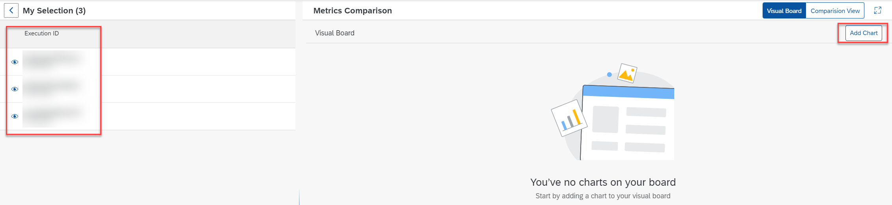
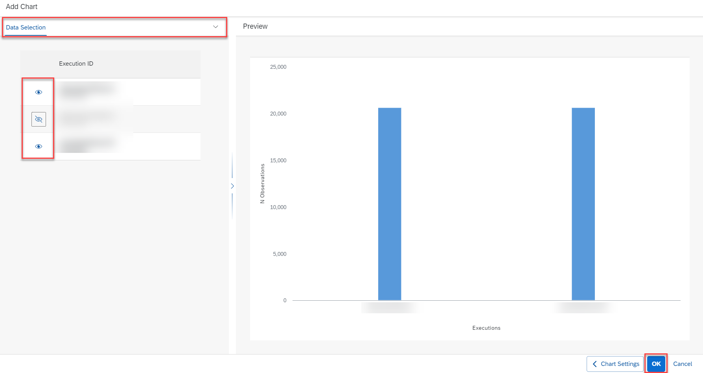

<!-- loio8b729965634c4eaf8d1f7170faf0eced -->

<link rel="stylesheet" type="text/css" href="css/sap-icons.css"/>

# Create Chart to Compare Executions

You can create a chart to visually compare quality criteria and values for executions.

## Context

You can create multiple charts and view them in the *Visual Board*.

> ### Note:  
> Each chart can include data for up to five executions.

<a name="loio8b729965634c4eaf8d1f7170faf0eced__steps_bgj_mhd_15b"/>

## Procedure

1.  In the *ML Operations* app, choose *Executions*.

2.  **Optional:** If you have a large list of executions, you can filter the list by choosing  \(Filter\). The *Filter* dialog appears.

    1.  Enter the execution ID or select a status.

    2.  Choose *Apply* to apply the filter to the list.

3.  Select the executions for comparison and choose *View Metrics*.

    

    The *Metrics Overview* appears for the selected executions. The execution IDs and descriptions are listed in the *My Selection* pane. The *Metrics Comparison* pane defaults to the chart view.

    

4.  Choose *Add Chart* to create a chart based on your selected executions.

    The *Add Chart* dialog appears.

5.  Enter the chart settings:

    -   Enter a name and description for the chart.
    -   In *Chart Settings*, choose `Executions` as the metrics source.
    -   In *Comparison Type*, choose your preferred comparison. You can compare metrics to parameters, to the source, or to steps or time. Based on your selection, you'll be prompted to select the metrics and values for comparison.

6.  Choose *Preview* to continue to the preview the chart settings.

    > ### Caution:  
    > If *Preview* is not enabled, review your settings and selections. Some settings are mandatory, and you can't proceed until specified. Some settings and data combinations don't correspond to a valid chart type.

7.  In the *Chart Selection* pane, select the chart type \(such as column or bar chart\). Note, the chart types available depend on the chart settings you defined.

8.  Choose *Data Selection* menu option to confirm the executions selected for the chart.

    You can show or hide executions from your selection, and see the impact on the preview chart.

    

9.  Choose *OK* to create the chart. The chart appears in your chart view.

10. **Optional:** Check the chart. Note, if you have multiple charts, you may need to scroll.

    1.  To display a chart in full-screen mode, choose  \(Open Full Screen\).

    2.  To edit a chart, choose :pencil2:.

    3.  To delete a chart from your visual board, choose :pencil2:

