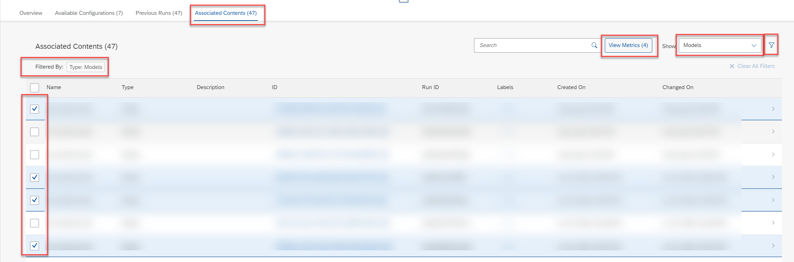
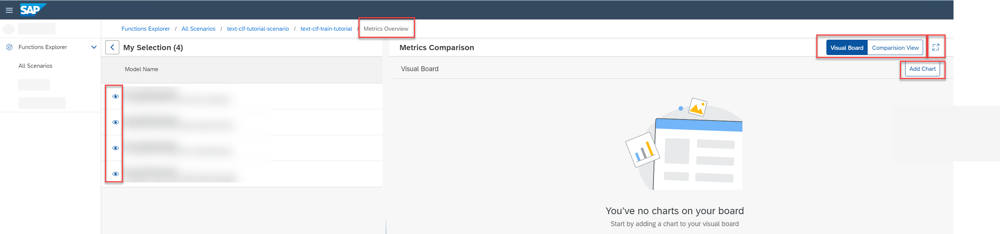

<!-- loio377db3572d9b444daeb6abb23ba1041f -->

<link rel="stylesheet" type="text/css" href="css/sap-icons.css"/>

# Create Chart to Compare Models

You can create charts for models to visually compare quality criteria and values.

<a name="loio377db3572d9b444daeb6abb23ba1041f__context_env_mq2_gab"/>

## Context

You create a chart to visualize metrics for:

-   A single model, or

-   Multiple models, comparing up to five models against timestamp, step, or configuration parameters

You can find and compare models at either scenario or run template level. You can create multiple charts and view them in the *Chart View*.

> ### Note:  
> Each chart can compare data for up to five models.

<a name="loio377db3572d9b444daeb6abb23ba1041f__steps_kwx_24s_ytb"/>

## Procedure

1.  In the *Functions Explorer* app, find and display a scenario. See [Investigate a Scenario](investigate-a-scenario-4547979.md).

2.  List the models for comparison:

    -   To list models for a scenario, select the *Associated Contents* tab.
    -   To list models for a run template, find and display the run template. See [Investigate a Run Template](investigate-a-run-template-b753dc0.md). Then select the *Associated Contents* tab.

    

3.  **Optional:** Select `Models` in the *Show* field to show the models generated by the run template.

4.  **Optional:** If you have a large list of models, you can further filter the list by choosing  \(Filter\).

5.  Select the models for comparison and choose *View Metrics*.

    The *Metrics Overview* appears for the selected models. The model IDs and descriptions are listed in the *My Selection* pane. The *Metrics Comparison* pane defaults to the chart view.

    

6.  Choose *Add Chart* to create a chart comparing the selected models.

    The *Add Chart* dialog appears.

7.  Enter the chart settings:

    -   Enter a name and description for the chart.
    -   In *Chart Settings*, choose `Models` as the metrics source.
    -   In *Comparison Type*, choose your preferred comparison. You can compare metrics to parameters, to the source, or to steps or time. Based on your selection, you'll be prompted to select the metrics and values for comparison.

8.  Choose *Preview* to continue to the preview settings.

    > ### Caution:  
    > If *Preview* is not enabled, review your settings and selections. Some settings are mandatory, and you can't proceed until specified. Some settings and data combinations don't correspond to a valid chart type.

9.  In the *Chart Selection* pane, select the chart type \(such as column or bar chart\). Note, the chart types available depend on the chart settings you defined.

10. Choose *Data Selection* from the dropdown menu to confirm the models selected for the chart.

    You can show or hide models from the data selection, and see the impact on the preview chart.

11. Choose *OK* to create the chart. The chart appears in your chart view.

12. **Optional:** Check the chart. Note, if you have multiple charts, you may need to scroll.

    1.  To display a chart in full-screen mode, choose  \(Open Full Screen\).

    2.  To edit a chart, choose :pencil2:.

    3.  To delete a chart from your chart view choose :pencil2:

