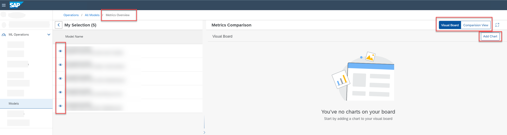
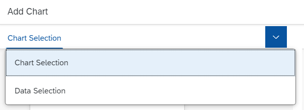

<!-- loioa943fa73549c45eebda50a24a99f3e77 -->

<link rel="stylesheet" type="text/css" href="css/sap-icons.css"/>

# Create Chart to Compare Models

You can create charts for models to visually compare quality criteria and values.

<a name="loioa943fa73549c45eebda50a24a99f3e77__context_env_mq2_gcb"/>

## Context

You create a chart to visualize metrics for:

-   A single model, or

-   Multiple models, comparing up to five models against timestamp, step, or configuration parameters

You can create multiple charts and view them in the *Visual Board*.

> ### Note:  
> Each chart can compare data for up to five models.

<a name="loioa943fa73549c45eebda50a24a99f3e77__steps_kwx_22s_yab"/>

## Procedure

1.  In the *ML Operations* app, choose *Models*.

    The *All Models* screen appears listing all of the models for the selected resource group. Models are listed by name, and with additional details such as description, ID, scenario, URL, execution ID, labels, created on timestamp, and changed on timestamp.

2.  **Optional:** If you have a large list of models, you can further filter the list by choosing  \(Filter\).

3.  **Optional:** Search the list by entering a model name or part of the model's description in the :mag: field.

4.  Select the models for comparison and choose *View Metrics*.

    The *Metrics Overview* appears for the selected models. The model IDs and descriptions are listed in the *My Selection* pane. The *Metrics Comparison* pane defaults to the chart view.

    

5.  Choose *Add Chart* to create a chart comparing the selected models.

    The *Add Chart* dialog appears.

6.  Enter the chart settings:

    -   Enter a name and description for the chart.
    -   In *Chart Settings*, choose `Models` as the metrics source.
    -   In *Comparison Type*, choose your preferred comparison. You can compare metrics to parameters, to the source, or to steps or time. Based on your selection, you'll be prompted to select the metrics and values for comparison.

7.  Choose *Preview* to continue to the preview settings.

    > ### Caution:  
    > If *Preview* is not enabled, review your settings and selections. Some settings are mandatory, and you can't proceed until specified. Some settings and data combinations don't correspond to a valid chart type.

8.  In the *Chart Selection* pane, select the chart type \(such as column or bar chart\). Note, the chart types available depend on the chart settings you defined.

9.  Choose *Data Selection* from the menu option to confirm the models selected for the chart.

    You can show or hide models from your selection, and see the impact on the preview chart.

    

10. Choose *OK* to create the chart. The chart appears in your chart view.

11. **Optional:** Check the chart. Note, if you already have multiple charts on your visual board, you may need to scroll.

    1.  To display a chart in full-screen mode, choose  \(Open Full Screen\).

    2.  To edit a chart, choose :pencil2:.

    3.  To delete a chart from your chart view choose :pencil2:

