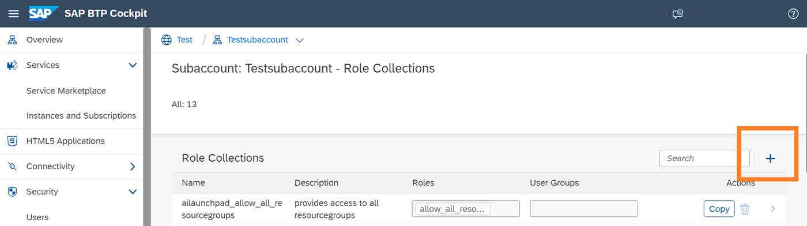
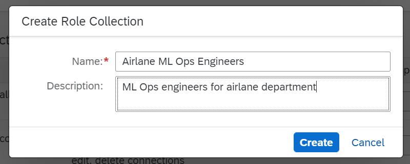

<!-- loio9cdb1ea43b4e4243a7fc5d4f2a656700 -->

<link rel="stylesheet" type="text/css" href="css/sap-icons.css"/>

# Create Role Collection

You create your own role collections and assign roles to them so that you can further manage users' access to content within SAP AI Launchpad.

<a name="loio9cdb1ea43b4e4243a7fc5d4f2a656700__prereq_ccd_jpq_h5b"/>

## Prerequisites

## Context

You create custom role collections to manage access settings for the following:

-   *Workspaces* app users, so that applicable resource groups are available to nominated users

-   *Workspaces* app users, so that applicable connections are available to nominated users
-   SAP Support users, so that they have custom access to available connections in your organization

## Procedure

1.  In SAP BTP cockpit, navigate to your subaccount and choose *Role Collections*.

    

2.  Choose :heavy_plus_sign: to add a role collection.

    > ### Remember:  
    > A role collection groups roles and users \(and their email IDs\) with a shared persona.

    

3.  Enter a name and description for the group of target users and choose *Create*.

    

4.  Choose *Edit* to add nominated users to this role collection.

    

5.  Enter the email ID of the nominated user and choose *Save*.

    If required, you can add more users \(and their emails IDs\) by choosing :heavy_plus_sign:.

    

6.  Choose *Save* to save the role collection.

    The role collection is now listed in the SAP BTP Cockpit and is available for assignment. For example, you can use the role collection to manage custom access for resource groups or connections. See [Custom Access for Connections](custom-access-for-connections-8ba6a92.md) and [Custom Access for Resource Groups](custom-access-for-resource-groups-19e3932.md).

