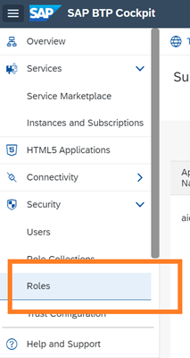

<!-- loio8ba6a922e774468d91df127725603bdf -->

# Custom Access for Connections

You can selectively control users' access to conections within SAP AI Launchpad.

<a name="loio8ba6a922e774468d91df127725603bdf__prereq_nxk_h4q_h5b"/>

## Prerequisites

You have created a role collection for use with custom connections. See [Create Role Collection](create-role-collection-9cdb1ea.md).

## Context

A role collection represents a shared user persona. A role collection groups roles and users \(and their email IDs\) who complete similar tasks.

By default, users of the *Workspaces* app have access to all the connections in their AI runtime. You provide custom access to selectively show connections to nominated roles and users.

> ### Tip:  
> For example, you may selectively control access if some connections involve sensitive data, or to simplify the selection options for users. You may also selectively provide access to an SAP Support user. See [Custom Access for Support User](custom-access-for-support-user-a2a95a0.md).

You manage access to connections by creating a custom role collection within SAP AI Launchpad, and assigning it a role based on the `allow_connections` role template. Nominated users within the *Workspaces* app, are then shown only the connections applicable for their work.

<a name="loio8ba6a922e774468d91df127725603bdf__steps_nj2_mlq_h5b"/>

## Procedure

1.  In SAP BTP cockpit, navigate to your subaccount and choose *Roles* to access the list of roles.

    

2.  Within the `ailaunchpad` application, find the `allow_connections` role template and choose *Create Role*.

3.  Complete the role details.

    1.  In the *Configure Role* wizard step, enter a name and description for the group of target users. You'll see that the `allow_connections` role template is automatically assigned to the role. Choose *Next* to continue.

    2.  In the *Configure Attributes* wizard step, enter the required connections in the *Values* column for the attribute `allow_connections`. Choose *Next* to continue.

        > ### Tip:  
        > To enter multiple connections, press *Enter* between connections and confirm the connection name. If you enter a value of `all`, you override any other connection value entered. This restores the system default and any custom settings are ignored.

    3.  In the *Select Role Collections* wizard step, search for and select the custom role collection that you've created for custom connections access. Choose *Next* to continue.

    4.  In the *Review* wizard step, check the role details and choose *Finish*.

<a name="loio8ba6a922e774468d91df127725603bdf__result_mxw_55q_hbi"/>

## Results

The role is now listed in the SAP BTP cockpit and the custom connection settings are applied. Users assigned to the `allow_connections` role \(or a role collection that contains it\), now have custom access to connections in their *Workspaces* app.

**Related Information**  

[Assign Connection to Workspace](set-resource-group-0c07728.md#loioa0204f94a94e4407abf772e76104d834 "")

