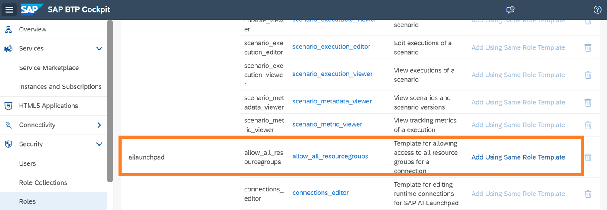
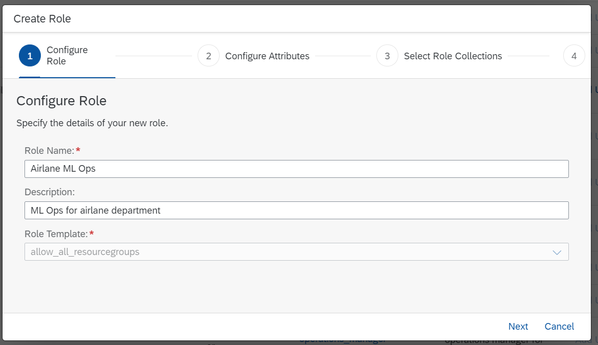

<!-- loio19e39328d7f44af6b3b8a83983bde325 -->

# Custom Access for Resource Groups

You can selectively control users' access to resource groups \(within an AI runtime connection\) in SAP AI Launchpad.

<a name="loio19e39328d7f44af6b3b8a83983bde325__prereq_cl3_ht3_1rb"/>

## Prerequisites

You are using the standard role collection, or you have created a role collection for use with custom resource groups. See [Create Role Collection](create-role-collection-9cdb1ea.md).

The users do not have the role collection `ailaunchpad_allow_all_resourcegroups` assigned.

<a name="loio19e39328d7f44af6b3b8a83983bde325__context_w15_fzq_h5b"/>

## Context

You can selectively control access to resource groups within an AI runtime connection. Nominated users of the *Workspaces* app, are then shown only those resource groups which are applicable for their work.

## Procedure

1.  In SAP BTP cockpit, navigate to your subaccount and choose *Roles* to access the list of roles.

    

2.  Within the `ailaunchpad` application, find the `allow_all_resourcegroups` role template, and choose *Add Using Same Role Template*.

    

    The *Create Role* wizard appears.

3.  Complete the role details.

    1.  In the *Configure Role* wizard step, enter a name and description for the group of target users. You'll see that the `allow_all_resourcegroups` role template is automatically assigned to the role. Choose *Next* to continue.

        

    2.  In the *Configure Attributes* wizard step, enter the required resource group IDs in the *Values* column for the attribute `allowed_all_resourcegroups`. Choose *Next* to continue.

        

    3.  In the *Select Role Collections* wizard step, search for and select the custom role collection that you've created for custom access. Choose *Next* to continue.

        

    4.  In the *Review* wizard step, check the role details and choose *Finish*.

        

<a name="loio19e39328d7f44af6b3b8a83983bde325__result_mxw_55q_gab"/>

## Results

The role is now listed in the SAP BTP cockpit and the custom resource group settings are applied. Users currently assigned to the `allow_all_resource_groups` role \(or a role collection that contains it\), now have custom access to resource groups in their *Workspaces* app.

**Related Information**  

[Assign Resource Group to Workspace](set-resource-group-0c07728.md#loio1fe43ac042ab46749bec34b50601dce0 " ")

