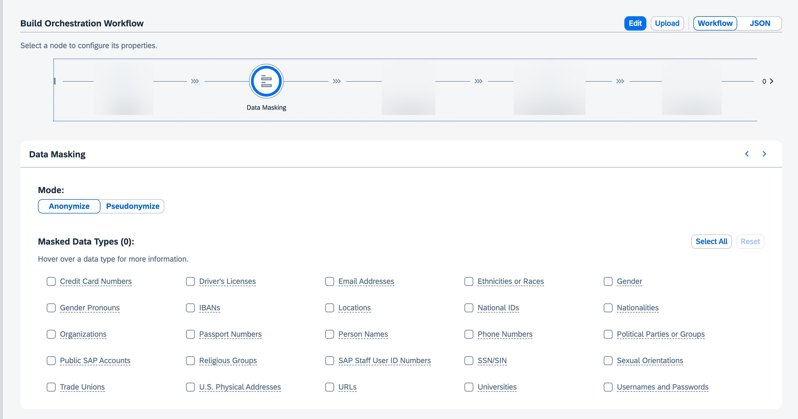

<!-- loio79911bdac16f47c294870741fdfef744 -->

# Data Masking

The data masking module is optional. It anonymizes or pseudonymizes personally identifiable information from the input, for selected entities.

The *Anonymize* button replaces personally identifiable information from selected categories with a `MASKED_ENTITY` placeholder. Anonymized data can not be unmasked as information about the original data is not retained.

The *Pseudonymize* button replaces personally identifiable information from selected categories with a `MASKED_ENTITY_ID` placeholder .Pseudonymized data can be unmasked in the response.

For more information on supported anonymization services, see [Orchestration Workflow in SAP AI Core](https://help.sap.com/docs/AI_CORE/2d6c5984063c40a59eda62f4a9135bee/b233648e0696461984410c38448fc81b.html) and choose Data Masking.

> ### Caution:  
> The masking service can mask personally identifiable information in the prompt. However, because it is using automated detection mechanisms, there is no guarantee that all personally identifiable information will be found and masked.
> 
> Anonymization, replaces personally identifiable information in an irreversible manner. This results in a loss of context, which may limit the capability of the LLM to process the input. For example, if asked to write a story about Ben and Anna, with anonymization of profile-person, the LLM would be asked to write a story about `MASKED_PERSON` and `MASKED_PERSON` and could no longer distinguish between the two.

