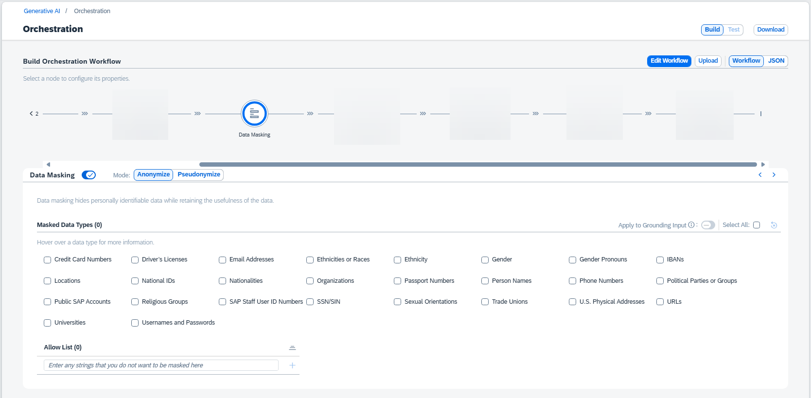

<!-- loio79911bdac16f47c294870741fdfef744 -->

# Data Masking

The data masking module is optional and serves to anonymize or pseudonymize personally identifiable information from the input for selected entities.

There are two ways in which you can mask data:

-   The *Anonymize* button replaces personally identifiable information in chosen categories with a `MASKED_ENTITY` placeholder. Anonymized data can't be unmasked because the original data isn't retained.
-   The *Pseudonymize* button substitutes personally identifiable information in selected categories with a `MASKED_ENTITY_ID` placeholder. Pseudonymized data can be unmasked in the response.

You can also choose whether to apply data masking to the content provided by the Grounding module.

When masking data, you can choose the types of data that are to be masked. For example, you can mask names, genders, credit card numbers, and so on. If there are any entities that you do not want to mask, you can add them to the exception list.

> ### Caution:  
> The masking service can obscure personally identifiable information in prompts. However, since it relies on automated detection mechanisms, it can't guarantee that all such information will be identified and masked.
> 
> Anonymization replaces personally identifiable information in an irreversible way. This leads to a loss of context, which may limit the model's ability to process the input. For instance, if tasked with writing a story about Michael and Donna, anonymization of profile-person would result in a story about `MASKED_PERSON` and `MASKED_PERSON`, making it impossible to distinguish between the two.

You can enter strings that you do not want to mask in the *Allow List*.

To include the data masking module in your orchestration workflow, activate it via the *Advanced* modules switch.

For more information about supported anonymization services, see the [Orchestration Workflow in SAP AI Core](https://help.sap.com/docs/AI_CORE/2d6c5984063c40a59eda62f4a9135bee/b233648e0696461984410c38448fc81b.html) and select *Data Masking*.

