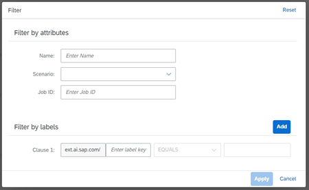

<!-- loiof4bebd478845414fb3b3ae08fdd2fe20 -->

<link rel="stylesheet" type="text/css" href="css/sap-icons.css"/>

# Datasets

A dataset provides the data used to train a model. Datasets are files which are stored in a hyperscaler storage bucket \(such as AWS S3\).

<a name="task_abl_vnp_prb"/>

<!-- task\_abl\_vnp\_prb -->

## Find a Dataset

<a name="task_abl_vnp_prb__prereq_zdr_n4p_prb"/>

## Prerequisites

You have the `scenario_artifact_viewer` role, or you have been assigned a role collection that contains this role.

For more information, see [Roles and Authorizations](security-e4cf710.md#loio4ef8499d7a4945ec854e3b4590830bcc).

<a name="task_abl_vnp_prb__steps_rxj_wnp_prb"/>

## Procedure

1.  In the *Functions Explorer* app, choose *All Scenarios*.

2.  Find the scenario and display its details. For more information, see [Investigate a Scenario](investigate-a-scenario-4547979.md).

3.  Select the *Associated Contents* tab to display datasets and models associated with the scenario.

4.  Check the list of available datasets.

    The columns show the following:

    -   The names of the datasets

    -   A unique identifier for each dataset

    -   The scenario associated with the dataset

    -   Custom tags \(labels\) that were associated with the dataset when it was created. You can view the labels associated with an dataset by choosing  \(Labels\)in the corresponding row.

    -   The timestamp when the dataset was created

5.  **Optional:** Search the list by entering a dataset name or part of the dataset description in the :mag: field.

    > ### Tip:  
    > When your runtime is SAP AI Core, this search is not case-sensitive. For other runtimes, search may be case-sensitive.

6.  **Optional:** Filter for a dataset in the list by choosing  \(Filter\). The *Filter* dialog appears.

    

    1.  Enter either the dataset name or other attributes.

    2.  Choose *Add* to include the filter criteria. Adjust the conditions as needed.

    3.  Choose *Apply* to apply the filter and conditions to the list.

