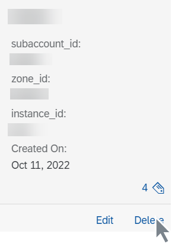

<!-- loiodc5373a8566a47f29ed121f798bd036d -->

# Delete a Resource Group

As an administrator, you delete resource groups which contain errors or which are no longer required in your AI processes.

<a name="loiodc5373a8566a47f29ed121f798bd036d__prereq_ukc_cwt_qxb"/>

## Prerequisites

You have the `aicore_admin_resourcegroup_editor` role or a role collection that contains it. For more information, see [Roles and Authorizations](https://help.sap.com/docs/ai-launchpad/sap-ai-launchpad/roles-and-authorizations).

<a name="loiodc5373a8566a47f29ed121f798bd036d__context_e2l_cwt_qxb"/>

## Context

You delete a resource group if it is invalid or contains errors, or if it is no longer required.

> ### Caution:  
> You can't delete the default resource group. The default resource group is automatically created when your tenant is onboarded, and it can't be deleted using the *SAP AI Core Administration* app.

<a name="loiodc5373a8566a47f29ed121f798bd036d__steps_wmr_cwt_qxb"/>

## Procedure

1.  In the *Workspaces* app, choose the AI API connection.

2.  Open the *SAP AI Core Administration* app and choose *Resource Groups*.

    The *Resource Groups* screen appears with a tile for each resource group.

3.  Find the tile for the resource group and choose *Delete*.

    

    The *Delete Resource Group* dialog box appears.

4.  Choose *Delete* to confirm the deletion, and remove the resource group from use.

<a name="loiodc5373a8566a47f29ed121f798bd036d__result_zl1_dwt_qxb"/>

## Results

The resource group is deleted, and any object store secrets added to the resource group are also deleted.

> ### Note:  
> Runtime entities created using the deleted resource group, such as executions and deployments, remain in the launchpad for reference purposes. However, when the associated resource group is deleted, the entities will no longer contain a reference to the deleted resource group.

