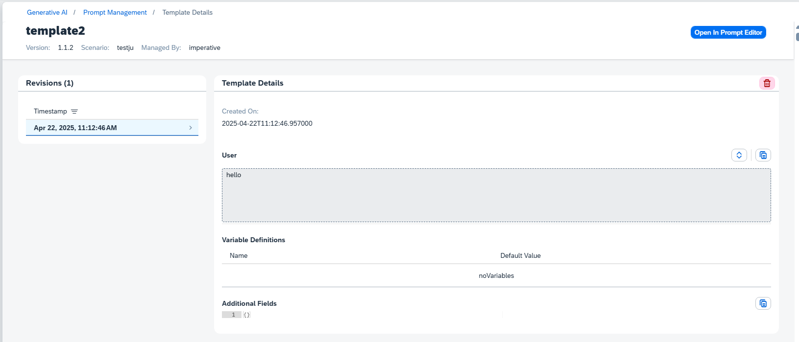

<!-- loio58e51d821046470f808c10aaf55f7ed6 -->

<link rel="stylesheet" type="text/css" href="css/sap-icons.css"/>

# Delete a Template

<a name="loio58e51d821046470f808c10aaf55f7ed6__prereq_yxf_gyb_rzb"/>

## Prerequisites

You have either the `genai_manager` or `prompt_manager` role, or you are assigned a role collection that contains one of these roles. For more information, see [Roles and Authorizations](security-e4cf710.md#loio4ef8499d7a4945ec854e3b4590830bcc).

<a name="loio58e51d821046470f808c10aaf55f7ed6__context_qmw_gtr_dfc"/>

## Context

This procedure explains how to delete templates in the generative AI hub. You can also delete templates through the *Scenarios* view in the *ML Ops* app. For more information, see [View a Scenario](view-a-scenario-6ef1b9a.md).

> ### Note:  
> Prompts and templates are saved in one region only and can only be retrieved or deleted by an instance of AI launchpad in that region.

> ### Restriction:  
> Only imperative templates can be deleted.

<a name="loio58e51d821046470f808c10aaf55f7ed6__steps_zr4_pq5_jzb"/>

## Procedure

1.  Select the connection to your SAP AI Core runtime in the *Workspaces* app and choose the resource group that was used for your *Generative AI Hub* deployment.

2.  In the *Workspaces* app, expand *Generative AI Hub* and choose *Prompt Management*.

3.  Select the *Templates* tab.

4.  Choose the template that you want to delete.

    The system lists all revisions for your chosen template.

5.  Choose a revision and use the :wastebasket: icon to delete it.

    To delete a template, delete all of its revisions.

    

