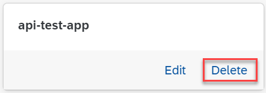

<!-- loiod503fb014bba4a3bbd17e96b8da1bb59 -->

# Delete an Application

As a system administrator, you can delete applications which sync with Git repositories used in your AI processes.

<a name="loiod503fb014bba4a3bbd17e96b8da1bb59__prereq_b1t_w3x_ycc"/>

## Prerequisites

You have the `aicore_admin_applications_editor` role or a role collection that contains it. For more information, see [Roles and Authorizations](security-e4cf710.md#loio4ef8499d7a4945ec854e3b4590830bcc).

<a name="loiod503fb014bba4a3bbd17e96b8da1bb59__context_glc_jrx_ycc"/>

## Context

You delete an application if it is invalid or contains errors, or if it is no longer required.

<a name="loiod503fb014bba4a3bbd17e96b8da1bb59__steps_rlm_jrx_ycc"/>

## Procedure

1.  In the *Workspaces* app, choose the AI API connection.

2.  Open the *SAP AI Core Administration* app and choose *Applications*.

    The *Applications* screen appears with a tile for each application.

3.  Find the tile for the application and choose *Delete*.

    

    The *Delete Application* dialog box appears.

4.  Choose *Delete* to confirm the deletion, and remove the application from use.

<a name="loiod503fb014bba4a3bbd17e96b8da1bb59__result_gab_yr4_asb"/>

## Results

The application no longer appears on the *Applications* screen.

