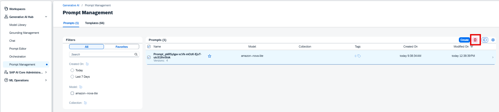
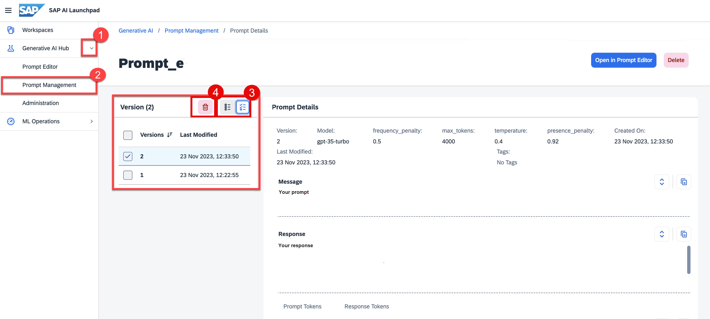
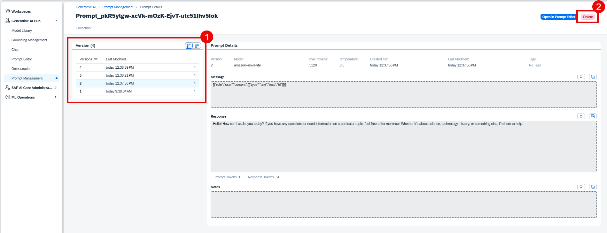

<!-- loioee440554f4b543dda957b0f844a06723 -->

# Delete Prompts

<a name="loioee440554f4b543dda957b0f844a06723__prereq_yxf_gyb_rzb"/>

## Prerequisites

You have either the `genai_manager` or `prompt_manager` role, or you are assigned a role collection that contains one of these roles. For more information, see [Roles and Authorizations](security-e4cf710.md#loio4ef8499d7a4945ec854e3b4590830bcc).

> ### Note:  
> Prompts and templates are saved in one region only and can only be retrieved or deleted by an instance of AI launchpad in that region.

## Procedure

1.  Navigate to *Prompt Management*. For more information, see [View a Saved Prompt](view-a-saved-prompt-d07a272.md).

2.  Choose the prompt you want to delete using the check boxes. You can choose multiple prompts by choosing multiple check boxes.

3.  Choose the *Delete* icon. Alternatively, you can choose *Delete* from the *Prompt Details* view.

    > ### Note:  
    > Deleting a prompt deletes all versions.

    

<a name="loio734d9ed5aac546c8a23c8a95f29853f0"/>

<!-- loio734d9ed5aac546c8a23c8a95f29853f0 -->

## Delete a Prompt Version

<a name="loio734d9ed5aac546c8a23c8a95f29853f0__steps_tfy_jcv_jzb"/>

## Procedure

1.  Navigate to your desired prompt. For more information, see [View a Saved Prompt](view-a-saved-prompt-d07a272.md).

2.  Switch the *Version* list to the *Select* view.

3.  Choose the prompt version you want to delete using the check boxes. You can choose multiple prompt versions by choosing multiple check boxes.

4.  Choose the *Delete* icon.

    

    Alternatively, you can delete all prompt versions by choosing *Delete*.

    

