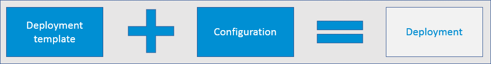
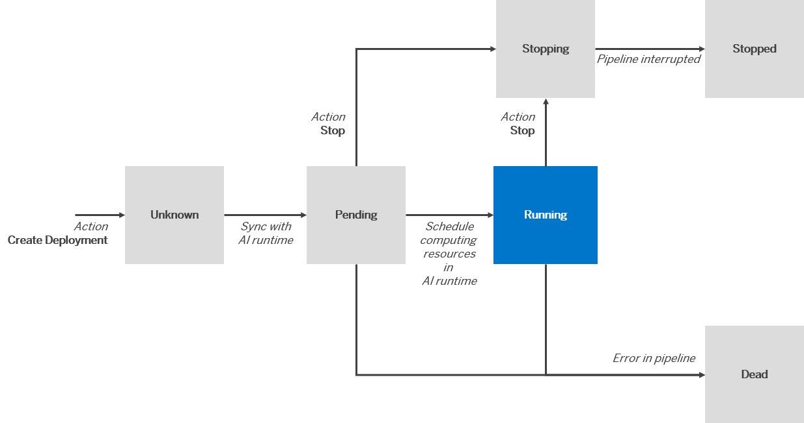

<!-- loio585b091af5504309a9c7b5d9d0d4198e -->

# Deployments

You use deployments to make online predictions.

You use SAP AI Launchpad to create deployments for your runtime connection. Deployments that are implemented on an SAP AI Core runtime produce `HTTPS` endpoints.

<a name="loio585b091af5504309a9c7b5d9d0d4198e__section_mvq_n1w_xtb"/>

## About Deployments

A deployment is used to make a prediction. A deployment creates a model server and generates a deployment URL. The URL is used for inference.

-   A deployment template defines the expected parameters and input dataset that is required for the deployment process.

-   Values for parameters and input dataset are provided by a configuration. A deployment takes one or more models and parameters from a configuration.

-   A deployment is created to start the deployment process with these values.

-   A deployment generates a URL for making online predictions.

<a name="loio585b091af5504309a9c7b5d9d0d4198e__section_e53_c1p_5nb"/>

## Deployment States

When a deployment has a *running* status, you can use it to make predictions. A deployment with a *stopped* status cannot be reused. To run a deployment again, create another deployment using the same configuration, and retain the combination of values for the deployment template and model. Multiple configurations can be created for a deployment. However, a *running* deployment can only refer to one configuration. You can update a deployment to change the referenced configuration.

Deployments can have any of the following statuses:

-   Pending
-   Running
-   Stopping
-   Stopped
-   Dead
-   Unknown

The following figure shows how deployment statuses change following the initial status of *Pending*:

  
  
**Deployment Status Flow**

When a deployment leaves *Running* status, the computing resources that were used by the AI runtime are released.

-   **[Investigate a Deployment](investigate-a-deployment-28463c4.md "You can explore deployment details for information about the deployment process for a
		model.")**  
You can explore deployment details for information about the deployment process for a model.
-   **[Create a Deployment](create-a-deployment-3bc6477.md "A deployment uses a model and data to make a prediction.")**  
A deployment uses a model and data to make a prediction.
-   **[Update a Deployment](update-a-deployment-c186783.md "You can update a deployment with your choice of configuration.")**  
You can update a deployment with your choice of configuration.
-   **[Stop a Deployment](stop-a-deployment-ed1162d.md "You can stop a deployment and release any computing resources acquired for the
		deployment.")**  
You can stop a deployment and release any computing resources acquired for the deployment.
-   **[Delete a Deployment](delete-a-deployment-1e6acb4.md "You can delete a deployment if it is no longer required. Deletion removes information
		about a deployment but does not delete the objects involved.")**  
You can delete a deployment if it is no longer required. Deletion removes information about a deployment but does not delete the objects involved.

