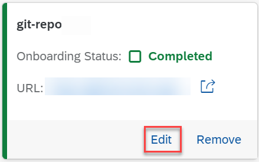

<!-- loiob5dabaf48571485385e647a6e809a64d -->

# Edit a Git Repository

As a system administrator, you can edit Git repositories which are used within your training and serving processes.

<a name="loiob5dabaf48571485385e647a6e809a64d__prereq_vfl_y1g_4xb"/>

## Prerequisites

You have the `aicore_admin_repositories_editor` role or a role collection that contains it. For more information, see [Roles and Authorizations](roles-and-authorizations-4ef8499.md).

You have access to the Git repository over the Internet.

<a name="loiob5dabaf48571485385e647a6e809a64d__context_wv1_1bg_4xb"/>

## Context

You change details for a Git repository if, for example, the name you have defined is not unique or its authentication details have changed.

> ### Note:  
> You cannot change the URL for the Git repository. If the URL is no longer valid or contains errors, you'll need to remove the Git repository and re-create it with the correct reference details. See [Remove a Git Repository](remove-a-git-repository-0701138.md).

<a name="loiob5dabaf48571485385e647a6e809a64d__steps_rpx_bbg_4xb"/>

## Procedure

1.  In the *Workspaces* app, choose the AI API connection.

2.  Open the *SAP AI Core Administration* app and choose *Git Repositories*.

    The *Git Repositories* screen appears with details of repositories for the connection, including name, status, and URL.

3.  Find the tile for the repo and choose *Edit*.

    

    The *Edit Git Repository* dialog box appears.

4.  Change the reference details in the *Edit Git Repository* dialog box as required:

    1.  Edit the name for the repository.

        Repository names must comply with the following criteria:

        -   Contain only lowercase alphanumeric characters, hyphens \(-\), or periods \(.\)

        -   Start with an alphanumeric character

        -   End with an alphanumeric character

    2.  Edit a user name and access token.

        The combination of user name and access token enables read access to the Git repository.

5.  Choose *Edit* to update the repo details with the changes.

<a name="loiob5dabaf48571485385e647a6e809a64d__result_zzj_5bg_4xb"/>

## Results

The updated repo appears on the *Git Repositories* screen.

