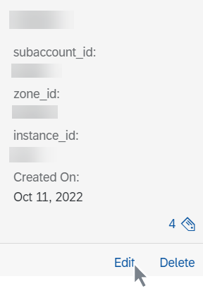

<!-- loio7c554d20eac145e18b57e8fd9003b350 -->

# Edit a Resource Group

As an administrator, you can edit resource groups used within your AI processes. You can change labels and values, or add, edit, or remove object store secrets associated with the resource group.

<a name="loio7c554d20eac145e18b57e8fd9003b350__prereq_zbh_bpc_rob"/>

## Prerequisites

You have the `aicore_admin_resourcegroup_editor` role or a role collection that contains it. For more information, see [Roles and Authorizations](roles-and-authorizations-4ef8499.md).

## Context

You edit a resource group when its labels change, or if you need to add or remove related object store secrets.

> ### Note:  
> You cannot change the name for a resource group. If the name is no longer valid or contains errors, you'll need to remove the resource group and re-create it with the correct details. See [Delete a Resource Group](delete-a-resource-group-dc5373a.md).

## Procedure

1.  In the *Workspaces* app, choose the AI API connection.

2.  Open the *SAP AI Core Administration* app and choose *Resource Groups*.

    The *Resource Groups* screen appears with a tile for each existing resource group.

3.  Choose *Edit* to change reference details for a resource group.

    

4.  Complete the fields in the *Edit Resource Group* dialog box.

    1.  Change the ***subaccount\_id*** value, if required.

    2.  Change the ***zone\_id*** value, if required.

    3.  Change the ***instance\_id*** value, if required.

    4.  If additional label changes are required, then change the label key or corresponding value.

5.  Choose *Edit* to save the changes to the resource group.

6.  **Optional:** You can also make changes to associated object store secrets. To do so, view the resource group details. Choose *Add*, *Edit*, or *Remove* to change an object store secret for the resource group. See [Edit an Object Store Secret](edit-an-object-store-secret-82938a5.md) and [Remove an Object Store Secret](remove-an-object-store-secret-775b306.md).

<a name="loio7c554d20eac145e18b57e8fd9003b350__result_omp_yr5_xsb"/>

## Results

The resource group is changed. The updated resource group appears on the *All Resource Groups* screen.

