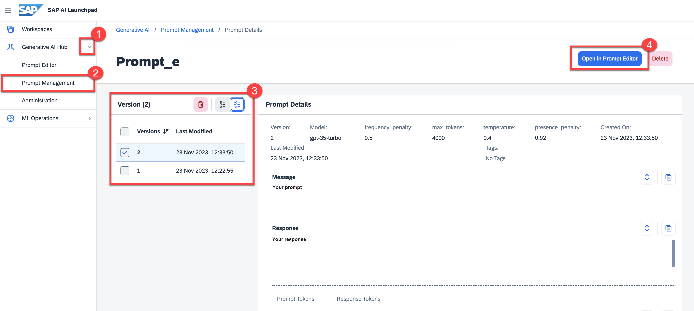

<!-- loio5f53a57b2beb4eac846201ecb4daae21 -->

# Edit a Saved Prompt

<a name="loio5f53a57b2beb4eac846201ecb4daae21__prereq_yxf_gyb_rzb"/>

## Prerequisites

-   You’ve selected the AI API connection and resource group that you used in the activation steps.

-   You have either the `genai_manager` or `prompt_manager` role, or you are assigned a role collection that contains one of these roles. For more information, see [Roles and Authorizations](roles-and-authorizations-4ef8499.md).

> ### Note:  
> Prompts are saved in one region only and can only be retrieved or deleted by an instance of AI launchpad in that region.

<a name="loio5f53a57b2beb4eac846201ecb4daae21__steps_tfy_jcv_jzb"/>

## Procedure

1.  Navigate to your desired prompt. For more information, see [View a Saved Prompt](view-a-saved-prompt-d07a272.md).

2.  Choose the entry for the version you want to edit.

3.  Choose *Open in Editor*. Make your changes.

    

    > ### Note:  
    > If the model used for your prompt is no longer available you will be notified when you open the prompt in the editor and you must choose another model.

    

## Next Steps

You can run your prompt again, making changes to the prompt message, parameters or model selection to change the outcome. For more information, see [Prompt Experimentation](prompt-experimentation-384cc0c.md).

