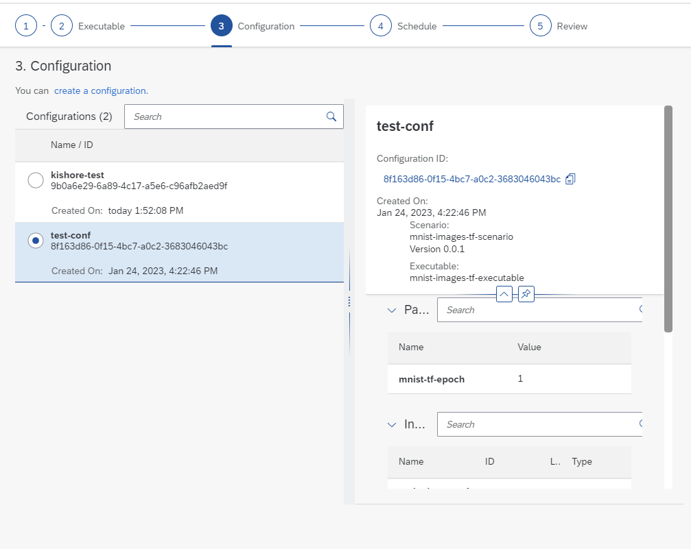
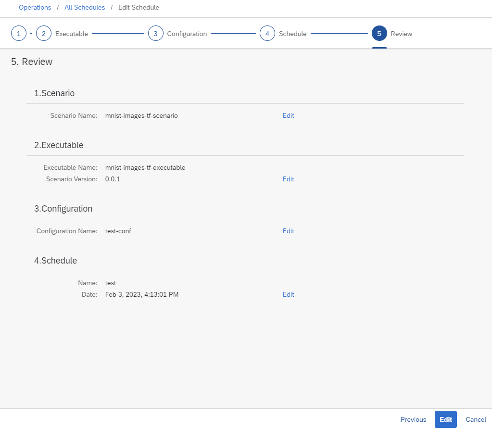

<!-- loio589aae99f38d45a69fe51c7a9fc6042c -->

# Edit a Schedule

Edit a schedule to change its recurrence, period of operation and the configuration used to create executions.

<a name="loio589aae99f38d45a69fe51c7a9fc6042c__prereq_nv2_wwp_kwb"/>

## Prerequisites

You have the `mloperations_editor` or `execution_schedules_editor role`, or you have been assigned a role collection that contains one of these roles. For more information, see [Roles and Authorizations](https://help.sap.com/docs/ai-launchpad/sap-ai-launchpad/roles-and-authorizations).

## Procedure

1.  Navigate to the Schedule's details. For more information, see [View a Schedule](view-a-schedule-1857004.md).

2.  Choose *Edit*.

    The delete schedule dialog box appears, with option to *Review* your steps.

3.  Navigate to the relevant step and make your changes. 

4.  Confirm your changes on the *Review* page.

5.  Press *Edit* to save your edits.

