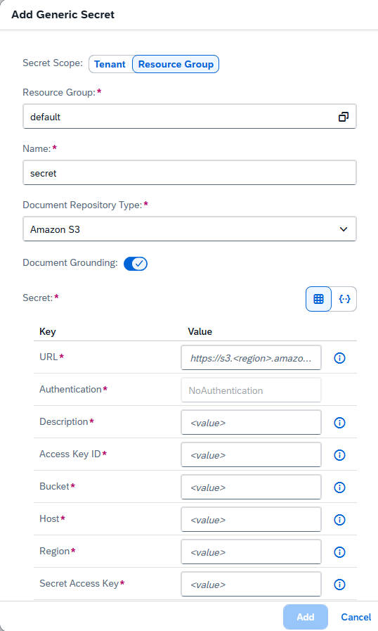

<!-- loio2a858aed9c7b4d8598ecbc8f6982af31 -->

<link rel="stylesheet" type="text/css" href="css/sap-icons.css"/>

# Edit a Secret


<a name="loio2a858aed9c7b4d8598ecbc8f6982af31__prereq_iqk_3mx_rxb"/>

## Prerequisites

-   You have the role `aicore_admin_genericsecret_editor` or a role collection that contains it. For more information, see [Roles and Authorizations](https://help.sap.com/docs/ai-launchpad/sap-ai-launchpad/roles-and-authorizations). You can change the secret credentials, but not the secret name or resource group. To change the secret name, delete the existing secret and create a new one.

-   You're using the SAP AI Core runtime.


<a name="loio2a858aed9c7b4d8598ecbc8f6982af31__steps_ztm_jmx_rxb"/>

## Procedure

1.  In the *Workspaces* app, choose the AI API connection.

2.  For secrets at the resource group level, choose your resource group. Alternatively, use the toggles in the header or dialog box, where the system prompts you to specify a resource group.

3.  Open the *SAP AI Core Administration* app and choose *Generic Secrets*.

4.  Find the tile for the secret and choose the :pencil2: icon.

    The *Edit Generic Secret* dialog box appears.

5.  Update the key:value pairs for your secret in one of the following ways:

    -   Deselect the *Document Grounding* switch and enter your secret in JSON format.
    -   Leave the *Document Grounding* switch selected and choose the document repository type from the dropdown list. The dialog adjusts dynamically for you to fill the remaining information.
    -   Leave the *Document Grounding* switch selected and switch to code view \(<span class="SAP-icons-V5"></span>\), where you can enter your secret in JSON format.

    The following examples show an Amazon S3 secret in JSON and form format. Different object stores require different information.

    

    > ### Note:  
    > The JSON key-value pairs correspond to the form fields shown in form mode, and may differ in format from the information provided by your object store provider.

    > ### Sample Code:  
    > ```
    > {
    >   "url": "<your repository URL",
    >   "description": "<your choice of decription>",
    >   "access_key_id": "<your access key ID>",
    >   "bucket": "<your S3 bucket name>",
    >   "host": "your S3 host",
    >   "region": "<your region>",
    >   "secret_access_key": "<your secret access key>",
    >   "username": "your AWS credentials username"
    > }
    > ```

6.  Choose *Edit* to save the changes to the secret.


<a name="loio2a858aed9c7b4d8598ecbc8f6982af31__result_lfs_jmx_rxb"/>

## Results

The updated secret appears on the *Generic Secrets* screen.

