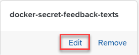

<!-- loio873d7c6a1fe8429592b2b2efe74227b2 -->

<link rel="stylesheet" type="text/css" href="css/sap-icons.css"/>

# Edit a Secret

As a system administrator, you can edit Docker registry secrets used within your AI processes.

<a name="loio873d7c6a1fe8429592b2b2efe74227b2__prereq_jxh_cq2_rob"/>

## Prerequisites

You have the `aicore_admin_dockerregistrysecret_editor` role or a role collection that contains it. For more information, see [Roles and Authorizations](roles-and-authorizations-4ef8499.md).

You have access to the Docker registry over the Internet.

<a name="loio873d7c6a1fe8429592b2b2efe74227b2__context_kcb_pxq_ysb"/>

## Context

You edit a secret when its credentials \(user name and access token\) change.

> ### Note:  
> You cannot change the name for a secret. If the name is no longer valid or contains errors, you'll need to remove the secret and re-create it with the correct details. See [Remove a Secret](remove-a-secret-5161312.md).

<a name="loio873d7c6a1fe8429592b2b2efe74227b2__steps_pwc_fmq_yes"/>

## Procedure

1.  In the *Workspaces* app, choose the AI API connection.

2.  Open the *SAP AI Core Administration* app and choose *Docker Registry Secrets*.

    The *Docker Registry Secrets* screen appears with a tile for each existing secret.

3.  Find the tile for the secret and choose *Edit*.

    

    The *Edit Docker Registry Secret* window appears. The name can't be changed, and the *Secret* field is empty.

4.  Enter the secret.

    1.  To copy the secret, copy the contents of the `data` parameter, as provided to you. The secret is between the parentheses. Paste the data into the *Secret* field.

    2.  To upload the secret as a `.TXT` or `JSON` file, choose  \(Upload\) . Search for and choose the secret from a local file. The file data then defaults to the *Secret* field.

        > ### Note:  
        > Files which are larger than 10 KB can't be uploaded.

5.  Choose *Edit* to save the changes for the secret.

<a name="loio873d7c6a1fe8429592b2b2efe74227b2__result_upp_yr4_xsb"/>

## Results

The updated secret appears on the *Docker Registry Secrets* screen.

