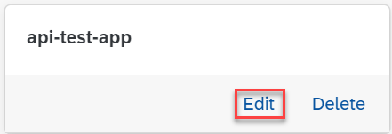

<!-- loio1c156f440aaa431ba09c10123e159b11 -->

# Edit an Application

As a system administrator, you can edit applications which sync with Git repositories used in your AI processes.

<a name="loio1c156f440aaa431ba09c10123e159b11__prereq_jxh_bpc_bob"/>

## Prerequisites

You have the `aicore_admin_applications_editor` role or a role collection that contains it. For more information, see [Roles and Authorizations](security-e4cf710.md#loio4ef8499d7a4945ec854e3b4590830bcc).

## Context

You edit an application if its source repository, path, or revision details change.

> ### Note:  
> You cannot change the name for an application. If the name is no longer valid or contains errors, you'll need to delete the application and re-create it with the correct details. See [Delete an Application](delete-an-application-d503fb0.md).

<a name="loio1c156f440aaa431ba09c10123e159b11__steps_gkj_m3k_ysb"/>

## Procedure

1.  In the *Workspaces* app, choose the AI API connection.

2.  Open the *SAP AI Core Administration* app and choose *Applications*.

    The *Applications* screen appears with a tile for each existing application.

3.  Find the tile for the application and choose *Edit*.

    

    The *Edit Application* dialog box appears.

4.  Change the reference details in the *Edit Application* dialog box as required:

    1.  Select an alternative source repository, if required. If you choose an alternative repository, you'll need to enter a path and version.

    2.  Change the path in the repository.

    3.  Change the revision value.

5.  Choose *Edit* to save the changes for the application.

    The *Applications* screen appears with the updated application.

