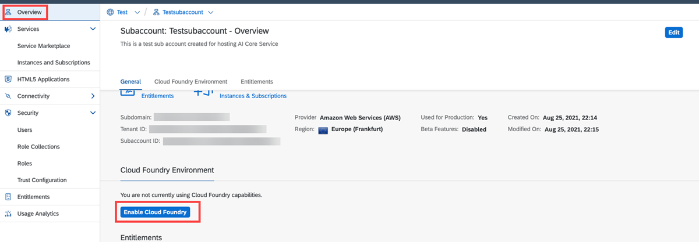
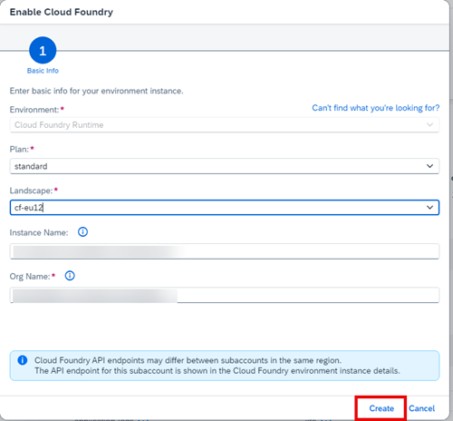

<!-- loiocf0d5d28f43645118d20b7a04fbab946 -->

# Enable Cloud Foundry

## Procedure

1.  Choose your subaccount and on the *Overview* page, choose *Enable Cloud Foundry*.

    

2.  Enter the basic information for your Cloud Foundry environment instance and click *Create*.

    

