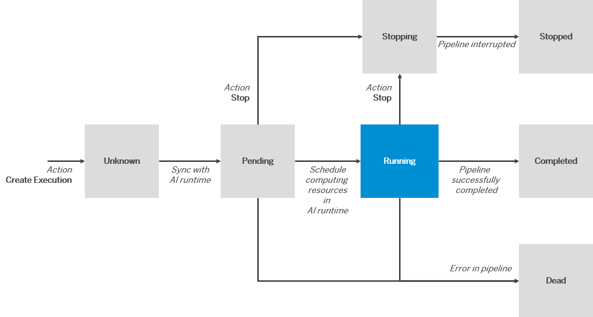

<!-- loio6a6afd5067cc40f39b2dffc45bcf03ba -->

# Executions

An execution is a training process or batch inferencing process for an AI scenario. The behavior of an execution is determined by the code pieces in the workflow executable.

A workflow executable is an AI pipeline that trains a model or generates batch inferencing. You use a configuration to set values \(parameters and datasets\) for a workflow executable. The configuration is then used to create an execution.

Depending on the code in the workflow executable, an execution accomplishes one of the following:

-   Trains and generates an AI model. For more information, see [Models \(artifacts\)](models-aba8797.md).
-   Generates batch inference \(predictions on subsets of data\). For more information, see [Result Sets \(Artifact\).](result-sets-cc7bacc.md) 

Multiple executions can be created using the same configuration. An execution is an instance of workflow executable \(used in the configuration\). For more information, see [Configurations](configurations-3c9d504.md).

> ### Note:  
> An execution runs only once and is not reusable. However, you can run another execution using the same configuration, and the same combination of values for workflow executable and dataset.

<a name="loio6a6afd5067cc40f39b2dffc45bcf03ba__section_ezk_y4q_qtb"/>

## Custom Features

> ### Remember:  
> The features that you see in the user interface depend on the capability settings in your underlying runtime/ service. For more information, see [Custom Runtime Capabilities Using the Meta API](custom-runtime-capabilities-using-the-meta-api-ac3d92b.md).

<a name="loio6a6afd5067cc40f39b2dffc45bcf03ba__section_fp4_bx4_5nb"/>

## Execution Statuses

Executions can have any of the following statuses:

-   Pending
-   Running
-   Stopping
-   Stopped
-   Completed
-   Dead
-   Unknown

The following figure shows how execution states can change following the initial status of *Pending*:

  
  
**Execution Status Flow**

When an execution leaves the *Running* status, the computing resources that were used by the AI runtime are released.

**Stop/ Delete Behavior by Status for Executions**

<table>
<tr>
<th valign="top">

Status

</th>
<th valign="top">

Stop Execution

</th>
<th valign="top">

Delete Execution

</th>
</tr>
<tr>
<td valign="top">

Unknown

</td>
<td valign="top">

Not enabled

</td>
<td valign="top">

Enabled

</td>
</tr>
<tr>
<td valign="top">

Pending

</td>
<td valign="top">

Enabled

</td>
<td valign="top">

Not enabled

</td>
</tr>
<tr>
<td valign="top">

Running

</td>
<td valign="top">

Enabled

</td>
<td valign="top">

Not enabled

</td>
</tr>
<tr>
<td valign="top">

Completed

</td>
<td valign="top">

Not enabled

</td>
<td valign="top">

Enabled

</td>
</tr>
<tr>
<td valign="top">

Stopping

</td>
<td valign="top">

Not enabled

</td>
<td valign="top">

Not enabled

</td>
</tr>
<tr>
<td valign="top">

Stopped

</td>
<td valign="top">

Not enabled

</td>
<td valign="top">

Enabled

</td>
</tr>
<tr>
<td valign="top">

Dead

</td>
<td valign="top">

Not enabled

</td>
<td valign="top">

Enabled

</td>
</tr>
</table>

-   **[Create an Execution](create-an-execution-6c90fc7.md "")**  

-   **[View an Execution](view-an-execution-33bae6d.md "You can view the details for an execution, and investigate details for each operation in the lifecycle process. You can use the overview
		like a dashboard to explore an execution's operations.")**  
You can view the details for an execution, and investigate details for each operation in the lifecycle process. You can use the overview like a dashboard to explore an execution's operations.
-   **[View Status Details](view-status-details-75b90de.md " You check the status details for an execution to see detailed code logs for a running execution. The status details include detailed
		status and workflow information.")**  
 You check the status details for an execution to see detailed code logs for a running execution. The status details include detailed status and workflow information.
-   **[Stop an Execution](stop-an-execution-9554f1c.md "Stopping an execution releases the computing resources acquired in the AI runtime in which the execution is present (such as SAP AI Core).")**  
Stopping an execution releases the computing resources acquired in the AI runtime in which the execution is present \(such as SAP AI Core\).
-   **[Stop Multiple Executions](stop-multiple-executions-78d9a92.md "")**  

-   **[Delete an Execution](delete-an-execution-51814db.md "You delete an execution to remove it from your instance. Deletion does not impact the associated model or result sets.")**  
You delete an execution to remove it from your instance. Deletion does not impact the associated model or result sets.
-   **[Delete Multiple Executions](delete-multiple-executions-f91741a.md "")**  

-   **[View the Metric Resource for an Execution](view-the-metric-resource-for-an-execution-d85dd44.md "Use metric data to determine a model's quality (accuracy, precision, or any other
		custom metric value).")**  
Use metric data to determine a model's quality \(accuracy, precision, or any other custom metric value\).
-   **[Compare Executions](compare-executions-9b75f67.md "You can compare executions to determine which configuration parameters result in optimum
		results.")**  
You can compare executions to determine which configuration parameters result in optimum results.
-   **[View Execution Logs](view-execution-logs-afec746.md "You check the logs for an execution to debug an issue with a training pipeline. ")**  
You check the logs for an execution to debug an issue with a training pipeline.

