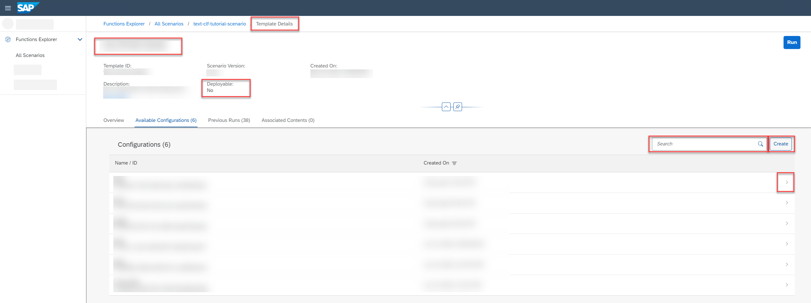

<!-- loio3f1d78dd009e4dc094950712fd012d57 -->

<link rel="stylesheet" type="text/css" href="css/sap-icons.css"/>

# Find a Configuration

You can view all the configurations associated with a run template, and investigate a configuration in detail.

<a name="loio3f1d78dd009e4dc094950712fd012d57__prereq_b54_nld_ccc"/>

## Prerequisites

You have the `scenario_configuration_viewer` or `scenario_configuration_editor` role, or you have been assigned a role collection that contains one of these roles.

For more information, see [Roles and Authorizations](security-e4cf710.md#loio4ef8499d7a4945ec854e3b4590830bcc).

<a name="loio3f1d78dd009e4dc094950712fd012d57__context_q1n_lhl_wtb"/>

## Context

A configuration is required to create a run. The configuration provides values for parameters and other inputs that the run template has defined. Multiple configurations can be associated with a run template.

<a name="loio3f1d78dd009e4dc094950712fd012d57__steps_fln_kz4_2rb"/>

## Procedure

1.  In the *Functions Explorer* app, choose *All Scenarios*.

2.  Find the run template and display its details. For more information, see [Investigate a Run Template](investigate-a-run-template-b753dc0.md).

3.  On the *Template Details* screen, select the *Available Configurations* tab.

    

    All configurations associated with the run template are listed, as well as details such as name, ID, and date of creation.

4.  **Optional:** Search the list by entering a configuration name or partial name in the :mag: field.

    > ### Tip:  
    > When your runtime is SAP AI Core, this search is not case-sensitive. For other runtimes, search may be case-sensitive.

5.  **Optional:** To create a new configuration, choose *Create*. See [Create a Configuration](create-a-configuration-c89e279.md).

6.  To view the details for a configuration, select a configuration in the list or choose  \(More\).

    The *Configuration Details* screen appears with the configuration name, configuration ID, scenario, template, created on timestamp, parameters, and inputs. To copy the configuration ID, click  \(Copy\).

