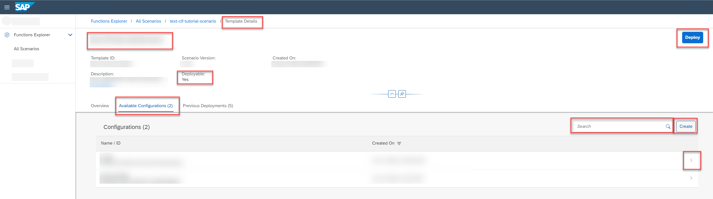

<!-- loio642037f6d79944cb85807ff537fe7db2 -->

<link rel="stylesheet" type="text/css" href="css/sap-icons.css"/>

# Find a Configuration

You can view all the configurations associated with a deployment template, and investigate a configuration in detail.

<a name="loio642037f6d79944cb85807ff537fe7db2__prereq_b54_nld_cxc"/>

## Prerequisites

You have the `mlfunctions_viewer` or `mlfunctions_editor` role, or you have been assigned a role collection that contains one of these roles.

For more information, see [Roles and Authorizations](roles-and-authorizations-4ef8499.md).

## Context

A configuration is required to create a deployment. Multiple configurations can be associated with a deployment template.

<a name="loio642037f6d79944cb85807ff537fe7db2__steps_fln_kz4_2rb"/>

## Procedure

1.  In the *Functions Explorer* app, find the deployment template and display its details. For more information, see [Investigate a Deployment Template](investigate-a-deployment-template-0f68ee0.md).

2.  On the *Template Details* screen, select the *Available Configurations* tab.

    All configurations associated with the deployment template are listed, as well as details such as configuration name and ID, and date of creation.

    

3.  **Optional:** Search the list by entering a configuration name or ID in the :mag: field.

    > ### Tip:  
    > When your runtime is SAP AI Core, this search is not case-sensitive. For other runtimes, search may be case-sensitive.

4.  **Optional:** To create a new configuration, choose *Create*. See [Create a Configuration](create-a-configuration-03fa29f.md).

5.  To show the details for a configuration, select a configuration in the list or choose  \(More\).

    The *Configuration Details* screen appears with the configuration name, configuration ID, scenario, template, created on timestamp, parameters, and inputs. To copy the configuration ID, click  \(Copy\).

