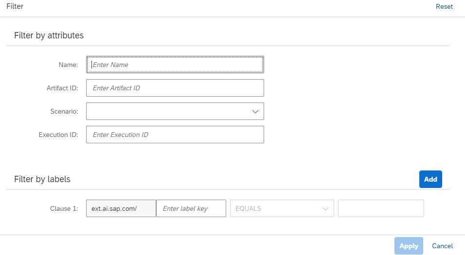

<!-- loiode82cedb8c3f4326b1929ed12b407822 -->

<link rel="stylesheet" type="text/css" href="css/sap-icons.css"/>

# Find a Dataset

Use the *ML Operations* app to search for a dataset.

<a name="loiode82cedb8c3f4326b1929ed12b407822__prereq_z4l_wdj_prb"/>

## Prerequisites

-   You have files which are stored in hyperscaler object storage and which have been registered as a dataset.

-   You have the `scenario_artifact_viewer` role or you are assigned a role collection that contains it. For more information, see [Roles and Authorizations](roles-and-authorizations-4ef8499.md).

-   You have specified the resource group as described at [Set Resource Group](set-resource-group-0c07728.md#loio0c077289f29d4147921fb07ab0f68b7f).

## Context

<a name="loiode82cedb8c3f4326b1929ed12b407822__steps_bz2_xdj_prb"/>

## Procedure

1.  In the *ML Operations* app, choose *Datasets*.

    The *Datasets* screen appears listing all of the datasets registered to your resource group for your runtime.

    Datasets are listed by name, and with additional details such as description, ID, scenario, execution ID, labels, created on timestamp, and changed on timestamp.

2.  **Optional:** Search the list by entering a dataset name or part of the dataset description in the :mag: field.

    > ### Tip:  
    > When your runtime is SAP AI Core, this search is not case-sensitive. For other runtimes, search may be case-sensitive.

3.  **Optional:** Filter the list by choosing  \(Filter\). The *Filter* dialog appears.

    

    1.  Enter the dataset name or other attributes.

    2.  Choose *Add* to include the filter criteria. Adjust the conditions as needed. You can add up to 10 filter conditions.

    3.  Choose *Apply* to apply the filter and conditions to the list.

    Once you've found the dataset, you can note the ID for use in a configuration.

