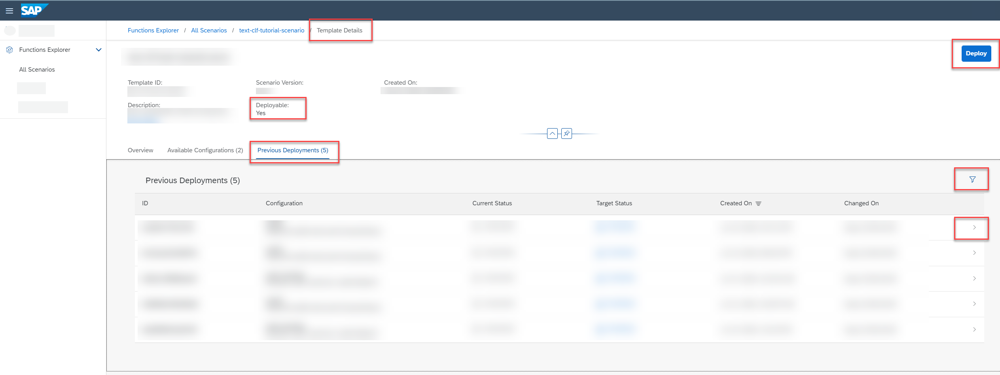

<!-- loio94f81c10df75460392176c731e421374 -->

<link rel="stylesheet" type="text/css" href="css/sap-icons.css"/>

# Find a Deployment

You can find a deployment and display its details.

<a name="loio94f81c10df75460392176c731e421374__prereq_wmn_qhk_wsb"/>

## Prerequisites

You have the `mlfunctions_viewer` or `mlfunctions_editor` role, or you have been assigned a role collection that contains one of these roles.

For more information, see [Roles and Authorizations](security-e4cf710.md#loio4ef8499d7a4945ec854e3b4590830bcc).

<a name="loio94f81c10df75460392176c731e421374__context_ymn_qhk_wsb"/>

## Context

A deployment is a process which deploys a model. A deployment is created using a configuration and a deployment template. Multiple deployments can be created for a deployment template.

> ### Tip:  
> In the *Functions Explorer* app, there are multiple ways to investigate a deployment's details. You can find a deployment via it's scenario and deployment template, or search for it via *All Deployments*.

<a name="loio94f81c10df75460392176c731e421374__steps_zmn_qhk_wsb"/>

## Procedure

1.  In the *Functions Explorer* app, find and display a deployment template. See [Investigate a Deployment Template](investigate-a-deployment-template-0f68ee0.md).

    The *Template Details* screen appears with overview, configuration, and deployment details for the selected deployment template.

2.  Select the *Previous Deployments* tab.

    The list displays all previous deployments for the template, with deployment ID, configuration name and ID, current and target status, and creation and change on dates.

    

3.  **Optional:** Filter the list by choosing  \(Filter\). The *Filter* dialog appears.

    1.  Enter the deployment ID or status.

    2.  Choose *Apply* to apply the filter to the list.

4.  **Optional:** To create a new deployment using the deployment template, choose *Deploy*. See [Create a Deployment](create-a-deployment-081b1a8.md).

5.  To investigate details for a deployment, select the deployment in the list or choose  \(More\).

    The *Deployment Details* screen appears with details such as the current and target status, scenario, deployment template, parameters, and dataset.

