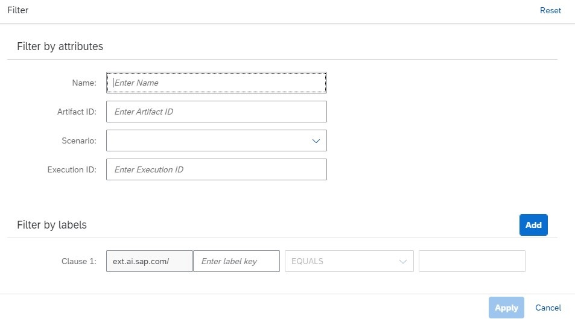

<!-- loioe8597671b4b343cebfa76bbe17982ceb -->

<link rel="stylesheet" type="text/css" href="css/sap-icons.css"/>

# Find an Other Artifact

Use the *ML Operations* app to search for other artifacts.

<a name="loioe8597671b4b343cebfa76bbe17982ceb__prereq_kpg_wm2_crb"/>

## Prerequisites

You have the `scenario_artifact_viewer` role, or you are assigned to a role collection that contains this role. For more information, see [Roles and Authorizations](roles-and-authorizations-4ef8499.md).

## Context

> ### Caution:  
> If the files for a registered artifact are deleted from your object store, or if the datapath or object store secret changes, then the registered artifact can no longer be used.

<a name="loioe8597671b4b343cebfa76bbe17982ceb__steps_ilr_4rh_xrb"/>

## Procedure

1.  Choose the resource group. For more information, see [Set Resource Group](set-resource-group-0c07728.md#loio0c077289f29d4147921fb07ab0f68b7f).

2.  In the *ML Operations* app, choose *Other Artifacts*.

    The *Other Artifacts* screen appears listing all associated artifacts. Other artifacts are listed by name, and with additional details such as description, ID, scenario, URL, execution ID, labels, created on timestamp, and changed on timestamp. Each artifact has a unique *ID*.

3.  **Optional:** Search the list by entering an artifact name or part of its description in the :mag: field.

    > ### Tip:  
    > When your runtime is SAP AI Core, this search is not case-sensitive. For other runtimes, search may be case-sensitive.

4.  **Optional:** Filter the list by choosing  \(Filter\). The *Filter* dialog appears.

    

    1.  Enter the artifact name or other attributes.

    2.  Choose *Add* to include the filter criteria. Adjust the conditions as needed.

    3.  Choose *Apply* to apply the filter and conditions to the list.

5.  Check the *Labels* column for the number of classifying phrases/ names applied to the artifact. Labels are specified when registering the artifact to the selected resource group.

