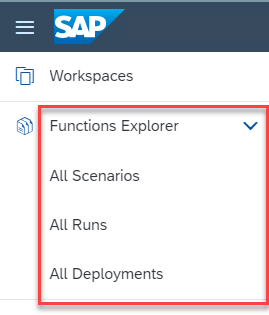

<!-- loio90586e67c82449d1b1ccb69bc3c9cfc8 -->

# Functions Explorer

The *Functions Explorer* app provides tools to explore scenarios which are offered by the AI service \(selected connection\) to which you are subscribed. Scenarios provide AI pipelines which you use to train or deploy an AI model.

A use case is a common business challenge that can be supported with AI insights.

Within the *Functions Explorer* app, a scenario represents a use case and it is used to link the objects and processes involved in an AI pipeline .

An AI pipeline consists of the following:

-   Scenarios

-   Templates \(run and deployment templates\)

-   Runs \(which generate models\)

-   Deployments \(which generate URLs for inferencing\)

-   **[Functions Explorer Overview](functions-explorer-overview-4988fa9.md "")**  

-   **[Scenarios](scenarios-3b5d965.md "As an AI scenario consumer, you subscribe to an AI service. The AI service comes with
		predefined AI use cases which are called scenarios.")**  
As an AI scenario consumer, you subscribe to an AI service. The AI service comes with predefined AI use cases which are called scenarios.
-   **[Runs](runs-396875a.md "A run is a training process that generates a model or models. A run is an instance of a
		run template (an AI pipeline), created using a configuration.")**  
A run is a training process that generates a model or models. A run is an instance of a run template \(an AI pipeline\), created using a configuration.
-   **[Deployments](deployments-585b091.md "You use deployments to make online predictions.")**  
You use deployments to make online predictions.

<a name="reference_l1x_ytp_prb"/>

<!-- reference\_l1x\_ytp\_prb -->

## Role Requirements

The *Functions Explorer* app has a number of standard role collections which group commonly required roles. For more information, see [Roles and Authorizations](roles-and-authorizations-4ef8499.md). You can also create your own role collections and assign roles to them based on your organizational requirements.

<a name="task_p2t_ftp_prb"/>

<!-- task\_p2t\_ftp\_prb -->

## Accessing the App

<a name="task_p2t_ftp_prb__prereq_hpx_gtp_prb"/>

## Prerequisites

-   You have one of the roles described in [Roles and Authorizations](roles-and-authorizations-4ef8499.md).

-   A connection has been established as described in [Assign Connection to Workspace](assign-connection-to-workspace-c05f144.md).

<a name="task_p2t_ftp_prb__steps_jpg_htp_prb"/>

## Procedure

In the *Functions Explorer* app, expand the app and explore its components.

