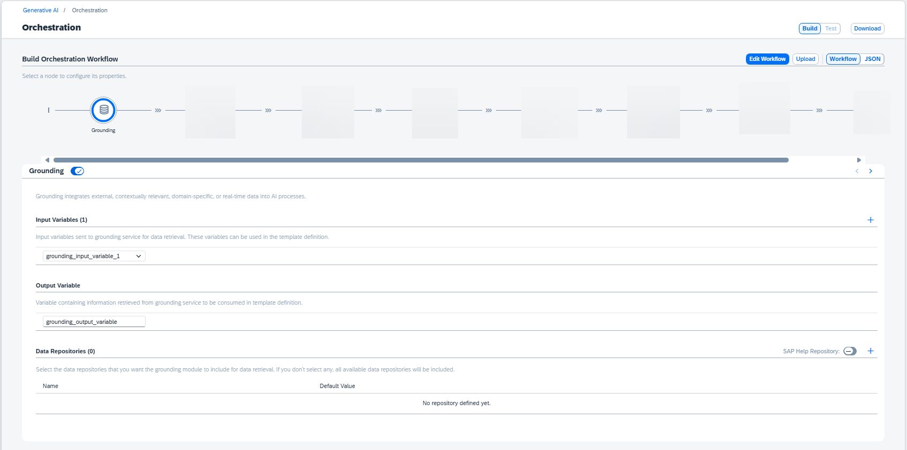

<!-- loio2d495d3fe46147a0b9fb0173d64d2579 -->

# Grounding

The grounding module is optional. It integrates external, contextually relevant, domain-specific, or real-time data into AI processes. This data supplements the natural language processing capabilities of pre-trained models, which are trained on general material.

Grounding is a service designed to handle data-related tasks, for example grounding and retrieval, using vector databases. It provides specialized data retrieval through vector databases, grounding the retrieval process using your own external and context relevant data. Grounding combines generative AI capabilities with the capacity to use real-time, precise data to improve decision-making and business operations, for specific business AI driven solutions.

The Pipeline API is proxied through the SAP AI Core generative AI hub, and incorporates vector stores, such as the managed HANA database. For more information, see [Pipeline API in SAP AI Core](https://help.sap.com/docs/AI_CORE/2d6c5984063c40a59eda62f4a9135bee/9c972e2301344a5f9511bff4bc7c4fcb.html).

To use the grounding module, you must first create a resource group and generic secret for grounding purposes. For more information, see [Create a Resource Group for AI Data Management](create-a-resource-group-for-ai-data-management-36ddabf.md) and [Create a Generic Secret for AI Data Management](create-a-generic-secret-for-ai-data-management-da05d4a.md).

You can provide input variables for data retrieval, which can be used in the template definition. Variables must have unique names.

You can select a data source. If no sources are selected, all available sources will be used.

