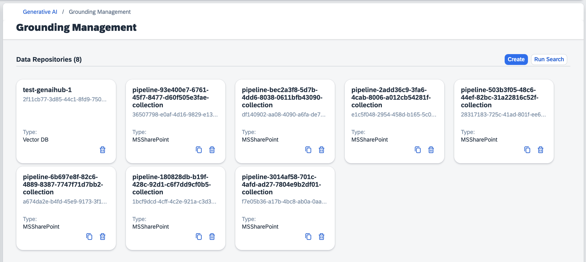
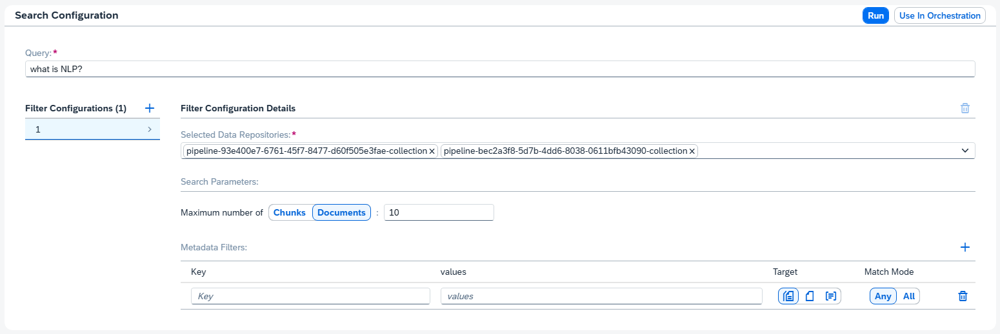

<!-- loio0ee0f52c4a824cd1b2950fb349fadbc5 -->

# Grounding Management

The grounding management app lets you manage the lifecycle of your data pipelines.

<a name="loio0ee0f52c4a824cd1b2950fb349fadbc5__section_y5p_prr_pdc"/>

## Prerequisites

You have the `genai_viewer`, `genai_experimenter`, `genai_manager`, `grounding_manager` or `grounding_viewer` role, or a role collection that contains one. For more information, see [Roles and Authorizations](security-e4cf710.md#loio4ef8499d7a4945ec854e3b4590830bcc).

You have resource group with the document grounding label enabled. For more information, see [Create a Resource Group for AI Data Management](create-a-resource-group-for-ai-data-management-36ddabf.md).

For users who want to create a data repository pipeline: you have a generic secret for AI data management with the grounding label enabled. For more information, see [Create a Generic Secret for AI Data Management](create-a-generic-secret-for-ai-data-management-da05d4a.md).

<a name="loio0ee0f52c4a824cd1b2950fb349fadbc5__section_o4k_vrr_pdc"/>

## Procedure

1.  Select the connection to your SAP AI Core runtime in the *Workspaces* app.

2.  In the side navigation, expand the *Generative AI Hub* and choose *Grounding Management*.

<a name="loio0ee0f52c4a824cd1b2950fb349fadbc5__section_rrw_vn4_22c"/>

## Data Repositories

Your data repositories are listed in the *Grounding Management* app.

Users with the `grounding_manager`or `genai_manager` can create a new repository.

To create a new repository, choose *Create*. Enter the repository details in the dialog box.

To include metadata, enable the switch.

For data repositories created without including metadata, you can specify which sub paths to include in the *Include paths* field.

> ### Remember:  
> You must choose a grounding generic secret that is associated with the document store type that you have selected.

Users with the `grounding_manager` or `genai_manager` roles can duplicate a repository. To duplicate a repository, use the *Duplicate* icon, and update the repository details in the dialog box.

Users with the `grounding_manager`or `genai_manager` can delete a repository. To delete a repository, use the *Delete* icon.

Choose a repository to view the data repository details.

<a name="loio0ee0f52c4a824cd1b2950fb349fadbc5__section_apm_nlh_22c"/>

## Data Repository Details Mode

To see the chunk preview, choose a document. Use the *Expand* icon to expand the chunks from preview to full.

To view the metadata for a document, use the *Metadata* tab.

To find a term in a document, use the search bar in the *Document Details* panel.

To find a document, enter a document ID into the search bar in the *Resources* panel.

Users with the `grounding_manager` or `genai_manager` roles can duplicate a repository. To duplicate a repository, use the *Duplicate* icon, and update the repository details in the dialog box.

Users with the `grounding_manager`or `genai_manager` can delete a repository. To delete a repository, use the *Delete* icon.

To configure a search over a pipeline, choose *Run Search*.

<a name="loio0ee0f52c4a824cd1b2950fb349fadbc5__section_mkv_cmh_22c"/>

## Run Documents Search Mode

Create a filter configuration using the*Create* icon and enter the following:

1.  Enter your natural language query in the *Query* field.
2.  Configure your filter by selecting repositories from the drop down list.

3.  Optionally, you can set the Maximum number of *Chunks* or *Documents* parameter.

4.  Optionally, you can include meta data filters using the *Create* icon and adding the following:

    -   A key as a string
    -   values as a comma separated list
    -   A target type by using the corresponding icon
    -   A match mode by using the corresponding icon

5.  To run the search, choose *Run*.

To delete a filter configuration, use the *Delete* icon.

To pass your search results to orchestration, choose *Use in Orchestration*

