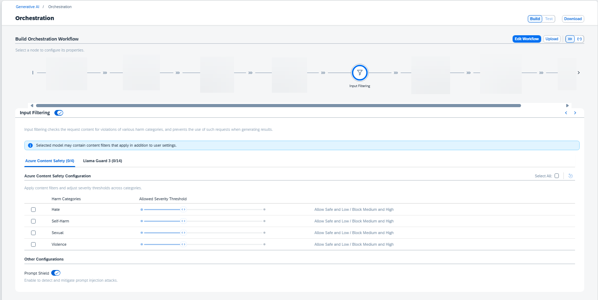

<!-- loiof5c722331f0d4151991886ebcf3f0f73 -->

# Input Filtering

Input filtering lets you decide the type of content that is passed to the generative AI model.

The module supports the following filters:

-   **Azure Content Safety:** This service recognizes four distinct content categories: `Hate`, `Violence`, `Sexual`, and `SelfHarm`. For more information, see [Harm categories in Azure AI Content Safety](https://learn.microsoft.com/en-us/azure/ai-services/content-safety/concepts/harm-categories?tabs=warning). Text can have more than one label \(for example, a text sample can be classified as both `Hate` and `Violence`\). The returned content categories include a severity level rating of 0, 2, 4, or 6. The value increases with the severity of the content. This service also includes prompt shield, which detects and mitigates prompt injection attacks. For more information, see[Content Filtering in SAP AI Core](https://help.sap.com/docs/sap-ai-core/sap-ai-core-service-guide/content-filtering-f80417519ea04adb86f7169ae871f884) .
-   **Llama Guard 3:** This service reognizes a range of categories inclduing `Hate`, `Specialized Advice`, `Defamation` and `Sexual Content`. For more information, see [Llama Guard 3](https://www.llama.com/docs/model-cards-and-prompt-formats/llama-guard-3/). Harm categories are Boolean values.

> ### Note:  
> Some generative AI models have content filters incorporated into their standard offering. This means that content may be filtered irrespective of the settings that you configure here.

If you edit the workflow, you can hide the filter section.

