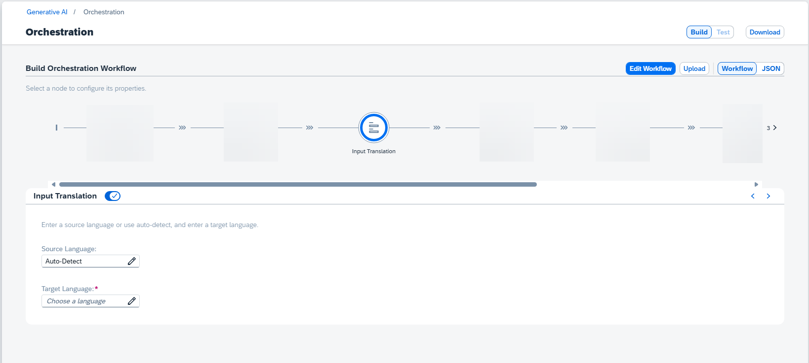

<!-- loio7ff3489788fa4bfd9524d3c5df30240e -->

# Input Translation

The input translation module is optional. It allows you to translate LLM text prompts into a chosen target language.

The input translation module helps improve answer quality when the configured model performs better with input in a specific language, for example English.

To use input translation, configure it as part of your orchestration workflow.

The module supports SAP's Document Translation service \(part of the SAP Translation Hub\).

> ### Caution:  
> Input translation is performed **before** any configured input masking. Any content added to the prompt as part of prompt templating is sent to the translation service unmodified.

For source language, you can choose one of the available languages, or no language is chosen, *Auto-Detect* will be used.

The target language is mandatory, choose from the available languages. The available languages may change based on your source language selection. For more information about compatible language pairs, see [SAP Translation Hub Supported Languages](https://help.sap.com/docs/SAP_TRANSLATION_HUB/ed6ce7a29bdd42169f5f0d7868bce6eb/6854bbb1bd824ffebc3a097a7c0fd45d.html).

> ### Caution:  
> Using unsupported pairs through auto-detect or source language input errors may result in error or poor quality results.

To include the input translation module in your orchestration workflow, activate it via the *Advanced* modules switch.

