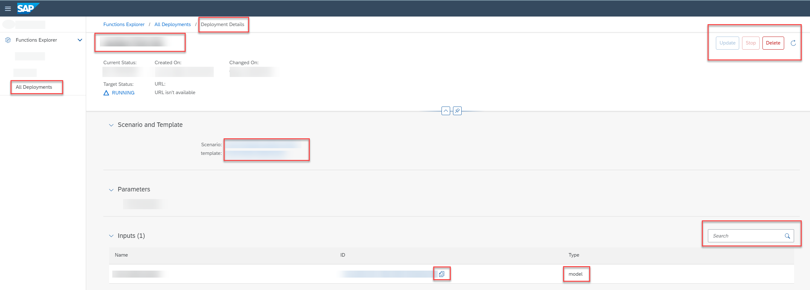

<!-- loio28463c49081b4ca29b60224ba42f160d -->

<link rel="stylesheet" type="text/css" href="css/sap-icons.css"/>

# Investigate a Deployment

You can explore deployment details for information about the deployment process for a model.

<a name="loio28463c49081b4ca29b60224ba42f160d__prereq_wmn_qhk_wsb"/>

## Prerequisites

You have the `mlfunctions_viewer` or `mlfunctions_editor` role, or you have been assigned a role collection that contains one of these roles.

For more information, see [Roles and Authorizations](security-e4cf710.md#loio4ef8499d7a4945ec854e3b4590830bcc).

<a name="loio28463c49081b4ca29b60224ba42f160d__context_sw4_wbw_xtb"/>

## Context

A deployment's details consists of scenario and template, parameters, and input model. The status of the deployment determines what you can do with the deployment. For example, a deployment with a running status can be stopped but not updated.

## Procedure

1.  In the *Functions Explorer* app, choose *All Deployments*.

    The *All Deployments* screen appears listing all existing deployments. Deployments are listed by ID, and with additional details such as configuration name and ID, current and target status, created on and changed on timestamps.

2.  **Optional:** Filter the list by choosing  \(Filter\). The *Filter* dialog appears.

    1.  Enter the deployment ID or status.

    2.  Choose *Apply* to apply the filter to the list.

3.  **Optional:** To create a new deployment, choose *Create*. See [Create a Deployment](create-a-deployment-3bc6477.md).

4.  To view the details for an individual deployment, select the deployment in the list or choose  \(More\).

    

    The *Deployment Details* screen appears with details such as the current and target status, scenario, deployment template, parameters, and dataset.

    > ### Tip:  
    > Timestamp details for each step in the deployment process can be seen in the header. These dates and times show when the deployment was created, submitted, started, and finished. The process duration is also displayed. Timestamps are displayed in your local time zone.

5.  **Optional:** Check the deployment details.

    1.  Select the scenario ID to navigate to the scenario details.

    2.  Select the template ID to navigate to the template details.

    3.  To search for an input or a parameter, enter a value or partial value in the :mag:field.

    4.  To copy the ID of the model, choose  \(Copy\).

6.  **Optional:** To refresh the current status of the deployment, choose  \(Refresh\).

7.  **Optional:** To update the deployment with a different configuration, choose *Update*. See [Update a Deployment](update-a-deployment-c186783.md).

8.  **Optional:** To stop the deployment, choose *Stop*. See [Stop a Deployment](stop-a-deployment-ed1162d.md).

9.  **Optional:** To delete the deployment, choose *Delete*. See [Delete a Deployment](delete-a-deployment-1e6acb4.md).

