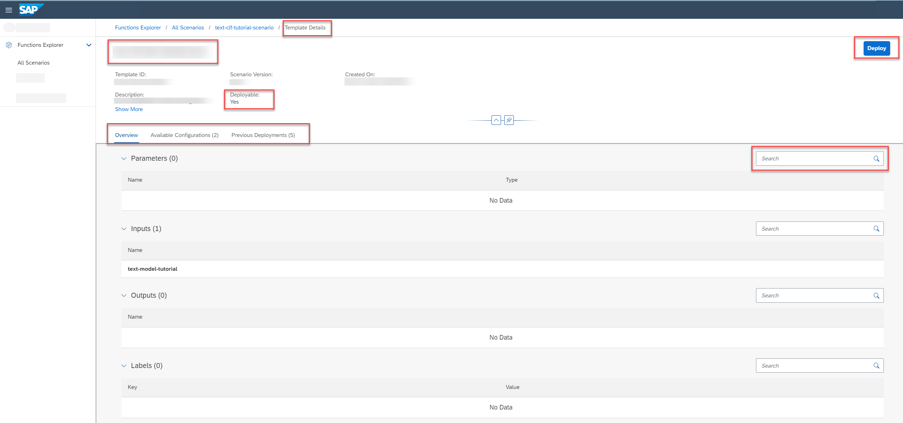

<!-- loio0f68ee0acedd46d29bb03ffd33eae9f6 -->

# Investigate a Deployment Template

Use the *Functions Explorer* app to view a list of deployment templates, and explore a template in detail.

<a name="loio0f68ee0acedd46d29bb03ffd33eae9f6__prereq_grm_pft_yab"/>

## Prerequisites

You have the `mlfunctions_viewer` or `mlfunctions_editor` role, or you have been assigned a role collection that contains one of these roles.

For more information, see [Roles and Authorizations](security-e4cf710.md#loio4ef8499d7a4945ec854e3b4590830bcc).

<a name="loio0f68ee0acedd46d29bb03ffd33eae9f6__steps_cjz_xpq_vsb"/>

## Procedure

1.  In the *Functions Explorer* app, choose *All Scenarios*.

2.  Find the scenario and display its details. For more information, see [Investigate a Scenario](investigate-a-scenario-4547979.md).

    The *Scenario Details* screen contains a *Templates* tab, which displays the run and deployment templates associated with the scenario, as well as summary details such as template ID, created on date, and number of parameters, inputs, and outputs.

3.  To view the details for a deployment template, double-click on a deployment template in the list.

    The *Template Details* screen appears, with the template ID, description, scenario version, created on timestamp, parameters, input dataset, output model, and labels.

    

    > ### Tip:  
    > Check the value of the *Deployable* field to confirm whether the template is a run or deployment template. Deployment templates are deployable \(`Yes`\).

4.  **Optional:** Select the *Available Configurations* tab to show the configurations associated with this template. See [Find a Configuration](find-a-configuration-642037f.md).

5.  **Optional:** Select the *Previous Deployments* tab to show the deployments associated with this template. See [Find a Deployment](find-a-deployment-94f81c1.md).

6.  **Optional:** To create a new deployment, choose *Deploy*. See [Create a Deployment](create-a-deployment-081b1a8.md).

<a name="loio0f68ee0acedd46d29bb03ffd33eae9f6__result_ab2_5r4_yqb"/>

## Results

The deployment template details page appears, with the name and timestamp details for the template, the dataset, and associated configurations and deployments.

