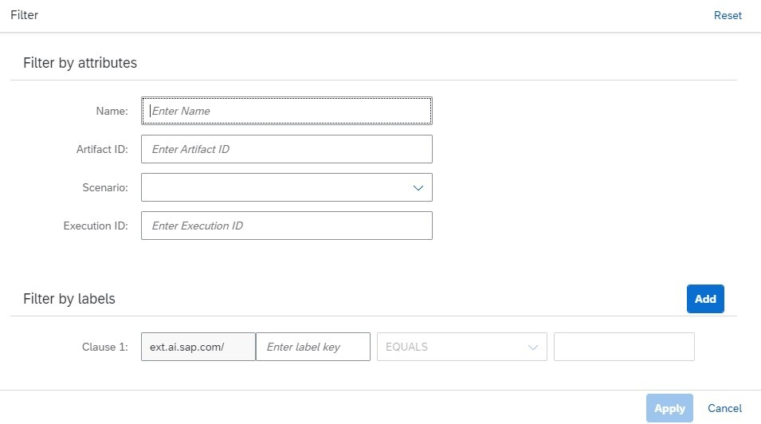

<!-- loio90d641f9a1f2421cb0a21fae697068ef -->

<link rel="stylesheet" type="text/css" href="css/sap-icons.css"/>

# Investigate a Model

Use the *ML Operations* app to list the models for your selected connection, and investigate their origin.

<a name="loio90d641f9a1f2421cb0a21fae697068ef__prereq_lmh_lrd_jpb"/>

## Prerequisites

You have the `scenario_artifact_viewer` or `scenario_metric_viewer` role, or you have been assigned a role collection that contains one of these roles.

For more information, see [Roles and Authorizations](roles-and-authorizations-4ef8499.md).

<a name="loio90d641f9a1f2421cb0a21fae697068ef__context_qdr_rbd_15b"/>

## Context

A model consists of both overview and metric data. Overview data summarizes the labels, parameters, and inputs associated with the source execution. Metric data is affected by the dataset and parameter values used by the execution, and can be used to determine a model's quality.

You can create a chart to visualize the performance of an individual model, or create a chart to compare models.

<a name="loio90d641f9a1f2421cb0a21fae697068ef__steps_qkj_n3p_5nb"/>

## Procedure

1.  Choose the resource group. For more information, see [Set Resource Group](set-resource-group-0c07728.md#loio0c077289f29d4147921fb07ab0f68b7f).

2.  In the *ML Operations* app, choose *Models*.

    The *Models* screen appears listing all of the models for the selected resource group. Models are listed by name, and with additional details such as description, ID, scenario, execution ID, labels, created on timestamp, and changed on timestamp.

    > ### Remember:  
    > You use a model ID to uniquely identify a model. This ID is used in your configuration as a value for a placeholder \(input artifact\) of a serving executable \(a pipeline to deploy an AI model\).

3.  **Optional:** Filter the list by choosing  \(Filter\). The *Filter* dialog appears.

    

    1.  Enter the model name or other attributes.

    2.  Choose *Add* to include the filter criteria. Adjust the conditions as needed.

    3.  Choose *Apply* to apply the filter and conditions to the list.

4.  **Optional:** Search the list by entering a model name or part of the model's description in the :mag: field.

    > ### Tip:  
    > When your runtime is SAP AI Core, this search is not case-sensitive. For other runtimes, search may be case-sensitive.

5.  Choose  \(Copy\) for your model to copy the model's unique ID.

    > ### Tip:  
    > To see how a model ID is used during a deployment, see [Create a Deployment](create-a-deployment-33b34e9.md).

6.  **Optional:** To create a chart for a model, select a model in the list and choose *View Metrics*. See [Create Chart to Compare Models](create-chart-to-compare-models-a943fa7.md).

7.  To view the details for a model and investigate its origin information, select a model in the list or choose  \(More\).

8.  **Optional:** For data about the quality \(confidence\) of a model, see [View Metrics for a Model](view-metrics-for-a-model-354931f.md).

