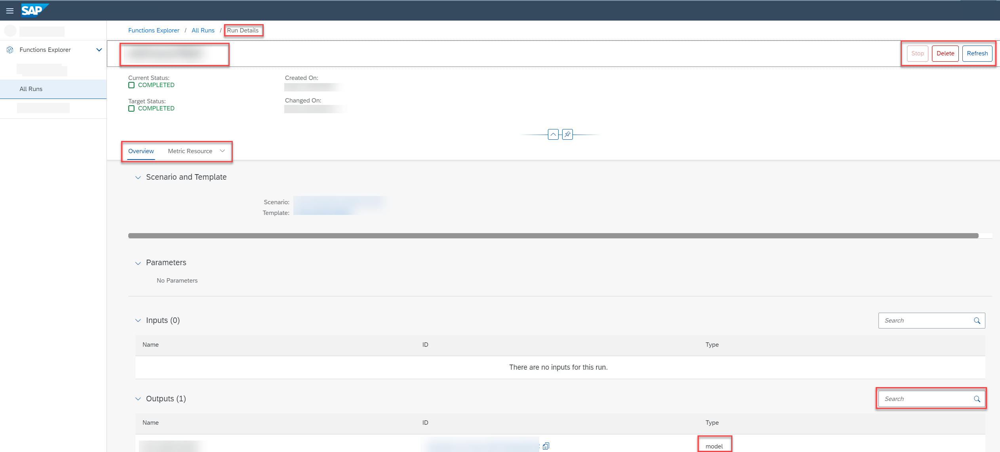

<!-- loioe4792441487e475082614f0a4a9b4486 -->

<link rel="stylesheet" type="text/css" href="css/sap-icons.css"/>

# Investigate a Run

You can explore run details for detailed insights about the training process for a model.

<a name="loioe4792441487e475082614f0a4a9b4486__prereq_b54_nld_jpb"/>

## Prerequisites

You have the `scenario_job_viewer` role, or you have been assigned a role collection that contains this role.

For more information, see [Roles and Authorizations](security-e4cf710.md#loio4ef8499d7a4945ec854e3b4590830bcc).

## Context

A run's details consists of two tabs: *Overview* and *Metric Resource*.

-   The *Overview* tab displays the scenario and template, as well as the parameters, input dataset and output model associated with the run.

-   The *Metric Resource* tab displays the performance metrics for the generated model.

## Procedure

1.  In the *Functions Explorer* app, choose *All Runs*.

    The *All Runs* screen appears listing all of the runs by ID, and with additional details such as configuration name and ID, current and target status, created on and changed on timestamps.

2.  **Optional:** To compare metrics for up to five runs, see [Compare Run Metrics](compare-run-metrics-0255655.md).

3.  **Optional:** Filter the list by choosing  \(Filter\). The *Filter* dialog appears.

    1.  Enter the run ID or select a status.

    2.  Choose *Apply* to apply the filter to the list.

4.  To view the details for a run, select a run in the list or choose  \(More\).

    The *Overview* tab displays details associated with the run, such as run ID, names of the associated scenario and template, parameters, input dataset, and output model.

    > ### Tip:  
    > To copy the ID of the input dataset or output model, choose  \(Copy\).

    

5.  **Optional:** Check the *Overview* tab for details such as scenario, template, parameters, input dataset, and output model.

    1.  Select the scenario ID to navigate to the scenario details.

    2.  Select the template ID to navigate to the template details.

    3.  To search for an input or output, enter a value or partial value in the :mag:field.

6.  **Optional:** To investigate the metrics and tags for a run, select the *Metric Resource* tab. See [View the Metric Resource for a Run](view-the-metric-resource-for-a-run-d4f29aa.md).

7.  **Optional:** To refresh the current status of the run, choose *Refresh*.

8.  **Optional:** To stop the run, choose *Stop*. See [Stop a Run](stop-a-run-a68bde6.md).

9.  **Optional:** To delete the run, choose *Delete*. See [Delete a Run](delete-a-run-543f58a.md).

**Related Information**  

[Compare Run Metrics](compare-run-metrics-0255655.md "You compare metrics for runs to determine which configuration parameters result in optimum results.")

