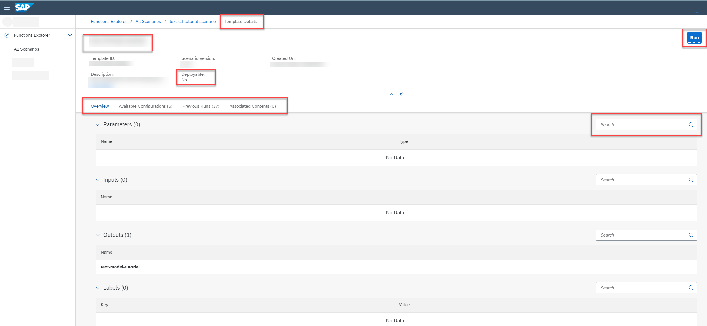

<!-- loiob753dc0f2e194510887ddf02da45c1ea -->

# Investigate a Run Template

Use the *Functions Explorer* app to view a list of run templates, and explore a template in detail.

<a name="loiob753dc0f2e194510887ddf02da45c1ea__prereq_grm_pft_yqb"/>

## Prerequisites

You have the `scenario_executable_viewer` role, or you have been assigned a role collection that contains this role.

For more information, see [Roles and Authorizations](security-e4cf710.md#loio4ef8499d7a4945ec854e3b4590830bcc).

## Procedure

1.  In the *Functions Explorer* app, choose *All Scenarios*.

2.  Find the scenario and display its details. For more information, see [Investigate a Scenario](investigate-a-scenario-4547979.md).

    The *Scenario Details* screen contains a *Templates* tab, which displays the run and deployment templates associated with the scenario, as well as summary details such as template ID, created on date, and number of parameters, inputs, and outputs.

3.  To view the details for a run template, double-click on a template in the list.

    The *Template Details* screen appears, with the template ID, description, scenario version, created on timestamp, parameters, input dataset, output model, and labels.

    

    > ### Tip:  
    > Check the value of the *Deployable* field to confirm whether the template is a run or deployment template. Run templates are **not** deployable.

4.  **Optional:** Select the *Available Configurations* tab to show the configurations associated with this template. See [Find a Configuration](find-a-configuration-3f1d78d.md).

5.  **Optional:** Select the *Previous Runs* tab to show the runs associated with this template. See [Find a Run](find-a-run-58bfae5.md).

6.  **Optional:** Select the *Associated Content* tab for datasets and models associated with this template. See [Associated Contents](associated-contents-680eae9.md).

7.  **Optional:** To create a new run, choose *Run*. See [Create a Run](create-a-run-ebc3f5c.md).

<a name="loiob753dc0f2e194510887ddf02da45c1ea__result_ab2_5r4_yqb"/>

## Results

You can use the run template to find the objects associated with the scenario and template.

