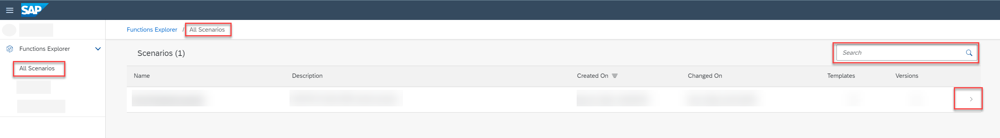
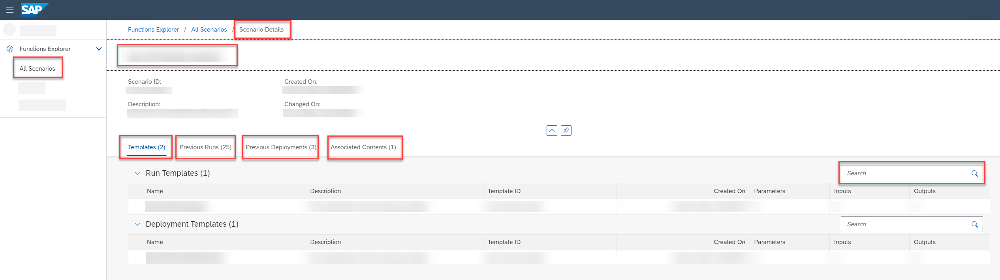

<!-- loio45479799959c4e019d1c811d466cfaaa -->

<link rel="stylesheet" type="text/css" href="css/sap-icons.css"/>

# Investigate a Scenario

In the *Functions Explorer* app, you can view a list of the scenarios available to you and explore their details.

<a name="loio45479799959c4e019d1c811d466cfaaa__prereq_b54_nld_jpb"/>

## Prerequisites

You have the `scenario_metadata_viewer` role, or you have been assigned a role collection that contains this role.

For more information, see [Roles and Authorizations](roles-and-authorizations-4ef8499.md).

<a name="loio45479799959c4e019d1c811d466cfaaa__steps_nvl_3kp_5nb"/>

## Procedure

1.  In the *Functions Explorer* app, choose *All Scenarios*.

    The *All Scenarios* screen appears listing all the scenarios in the resource group along with their description, created on and changed on timestamps, and number of templates and versions.

    

2.  **Optional:** Scroll to a scenario or use :mag: to search for a scenario by name.

3.  To view the details for an individual scenario, select the scenario in the list or choose  \(More\).

    The *Scenario Details* screen appears, with the scenario name, ID, created on and changed on timestamps.

    

    The objects associated with the scenario can be explored in more detail using the tabs:

4.  **Optional:** Investigate the scenario.

    -   Choose the *Templates* tab for run and deployment template details. See [Templates](templates-442a7e8.md).
    -   Choose the *Previous Runs* tab to list runs associated with this scenario. See [Investigate a Run](investigate-a-run-e479244.md).
    -   Choose the *Previous Deployments*, for deployments associated with this scenario. See [Investigate a Deployment](investigate-a-deployment-28463c4.md) .
    -   Choose the *Associated Contents*, for related input datasets and output models. See [Associated Contents](associated-contents-680eae9.md).

