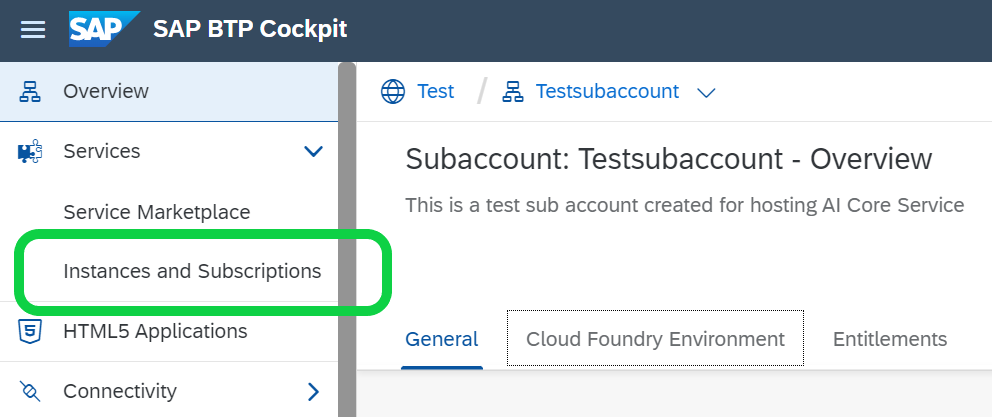
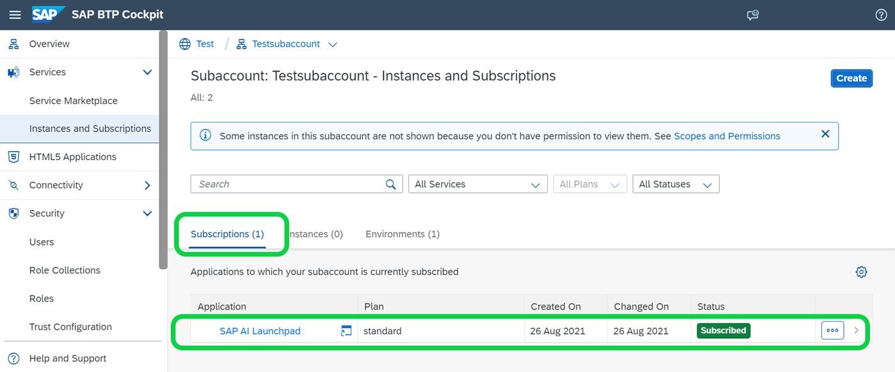
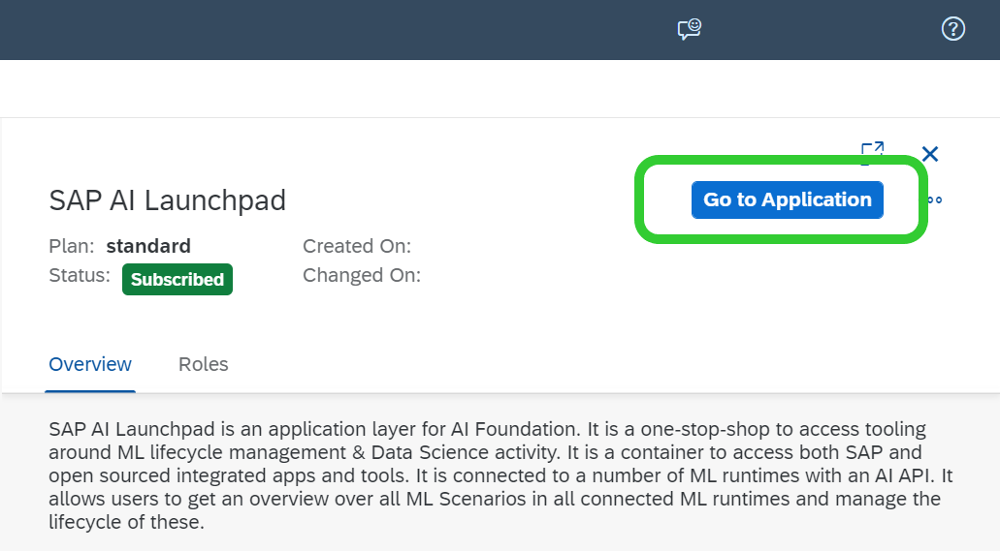
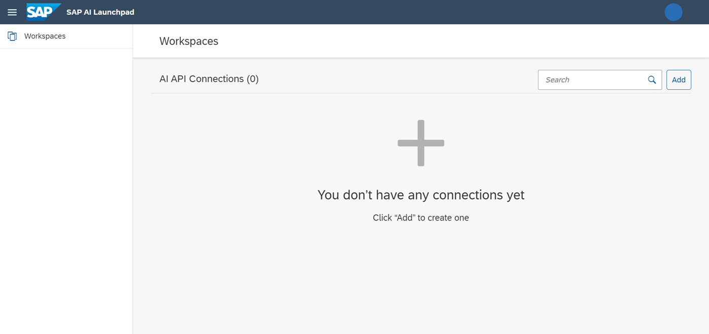

<!-- loiocea3f3b4d2ec48bcb3a033bd03989d6e -->

# Launch SAP AI Launchpad

You access SAP AI Launchpad from your subaccount.

<a name="loiocea3f3b4d2ec48bcb3a033bd03989d6e__prereq_n1d_v1h_rrb"/>

## Prerequisites

You have been assigned a role or role collection that grants you access to SAP AI Launchpad as described at [Allow Access to SAP AI Launchpad](allow-access-to-sap-ai-launchpad-8c84776.md).

## Procedure

1.  Open the SAP BTP cockpit.

2.  Go to your global account and subaccount.

3.  Choose *Instances and Subscriptions*.

    

4.  On the *Subscriptions* tab, click the row that contains your SAP AI Launchpad application.

    

5.  In the SAP AI Launchpad details area, choose *Go to Application*.

    

    You will be redirected to the initial screen of SAP AI Launchpad.

     

