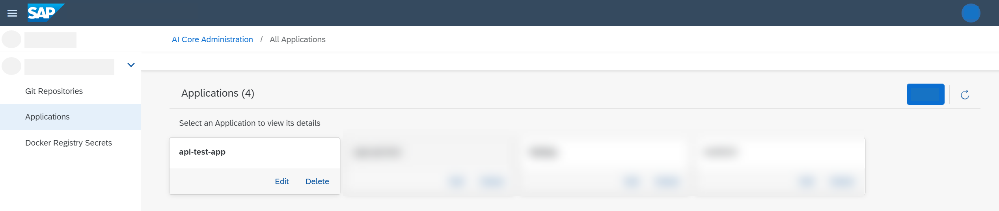

<!-- loiocf2f1d9608584fbbbe40ed3026756b8f -->

# Manage Applications

You can maintain a list of applications used within your AI processes.

## Context

After you have added a Git repository, you'll need to create an application to synchronize your templates in the repository. You use the *SAP AI Core Administration* app to create and manage applications used by your instance of SAP AI Core \(your AI runtime\).

> ### Note:  
> The timing for the initial synchronization is determined by the sync policy for the application. Syncing is not initiated when the application is created in SAP AI Launchpad, as it is managed externally. To check if your application has synced with your Git repository, or to check sync health, you can check the sync data in the application details. See [View an Application](view-an-application-edb1aa0.md).

> ### Note:  
> Users with the `aicore_admin_applications_viewer` role \(or a role collection that contains it\), can view an application's details but not make changes.

-   **[View an Application](view-an-application-edb1aa0.md "You can investigate details for an application used within your instance of SAP AI Core. ")**  
You can investigate details for an application used within your instance of SAP AI Core.
-   **[Create an Application](create-an-application-6825db6.md "As a system administrator, you create applications which sync with Git repositories used
		in your AI processes. ")**  
As a system administrator, you create applications which sync with Git repositories used in your AI processes.
-   **[Edit an Application](edit-an-application-1c156f4.md "As a system administrator, you can edit applications which sync with Git repositories
		used in your AI processes. ")**  
As a system administrator, you can edit applications which sync with Git repositories used in your AI processes.
-   **[Delete an Application](delete-an-application-d503fb0.md "As a system administrator, you can delete applications which sync with Git repositories
		used in your AI processes.")**  
As a system administrator, you can delete applications which sync with Git repositories used in your AI processes.

**Related Information**  

[Create an Application to Sync your Folders](https://help.sap.com/docs/AI_CORE/2d6c5984063c40a59eda62f4a9135bee/fd1aa517b21e495caa691259da38a5d0.html)

