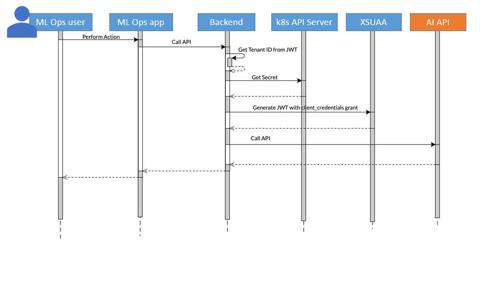

<!-- loio6fb7cc048f59444cbaafe6e69f184abf -->

# Manage Docker Registry Secrets

You can maintain a list of Docker registry secrets for use within your AI processes.

## Context

A Docker registry secret holds Docker credentials which enable you to pull Docker images from a Docker registry.

Within SAP AI Core, Docker registry secrets and images are referenced in serving and workflow templates. When an execution or deployment is created using these templates, the credentials are required to read from the Docker registry and pull the associated Docker image.

The example below shows how the Docker secret is used when an ML Operations user creates a deployment.

You use the *SAP AI Core Administration* app to add and manage Docker registry secrets. The app supports Docker registry secrets with `Base64` encoding.

Docker registry secrets contain sensitive information. Users with the `aicore_admin_dockerregistrysecret_viewer` role \(or a role collection that contains it\), can view Docker registry secret names but not credentials.

-   **[Add a Secret](add-a-secret-d346abd.md "As a system administrator, you can add Docker registry secrets for use within your AI
		processes. ")**  
As a system administrator, you can add Docker registry secrets for use within your AI processes.
-   **[Edit a Secret](edit-a-secret-873d7c6.md "As a system administrator, you can edit Docker registry secrets used within your AI
		processes.")**  
As a system administrator, you can edit Docker registry secrets used within your AI processes.
-   **[Remove a Secret](remove-a-secret-5161312.md "As a system administrator, you can remove Docker registry secrets used within your AI
		processes.")**  
As a system administrator, you can remove Docker registry secrets used within your AI processes.

**Related Information**  

[Create Your Docker Registry Secret](https://help.sap.com/docs/AI_CORE/2d6c5984063c40a59eda62f4a9135bee/b29c7437a54f46f39c911052b05aabb1.html)

