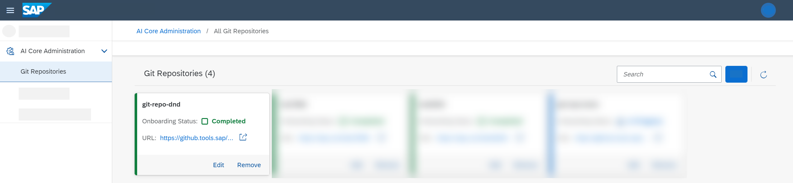

<!-- loioa63b9079624e4ff590c3bfd1a799dc2a -->

# Manage Repositories

You can maintain a list of Git repositories for use within your AI processes.

## Context

Git repositories are used for storing versions of training and serving templates.

You use the *SAP AI Core Administration* app to add Git repositories to your instance of SAP AI Core \(your AI runtime\). You can add multiple repositories, edit their details, or remove a repository if it is no longer required. The Git repositories you define are available for selection and use in applications.

-   **[Add a Git Repository](add-a-git-repository-c8cd251.md "As a system administrator, you can add Git repositories which can be used within your
		training and serving processes. ")**  
As a system administrator, you can add Git repositories which can be used within your training and serving processes.
-   **[Edit a Git Repository](edit-a-git-repository-b5dabaf.md "As a system administrator, you can edit Git repositories which are used within your
		training and serving processes. ")**  
As a system administrator, you can edit Git repositories which are used within your training and serving processes.
-   **[Remove a Git Repository](remove-a-git-repository-0701138.md "As a system administrator, you can remove a Git repository from use within your training
		and serving processes.")**  
As a system administrator, you can remove a Git repository from use within your training and serving processes.

**Related Information**  

[Setting Up Your Git Repository](https://help.sap.com/docs/AI_CORE/2d6c5984063c40a59eda62f4a9135bee/3269092e37d141a293f0dbd7eaafc829.html)

