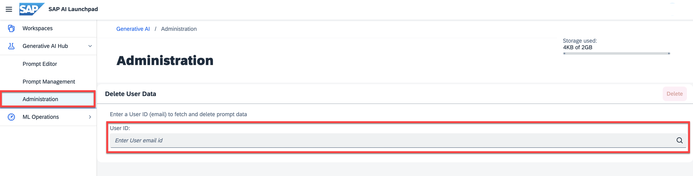

<!-- loio0d8d3cc40a0d454fb6efd344caec9ade -->

# Manual User Offboarding

<a name="loio0d8d3cc40a0d454fb6efd344caec9ade__prereq_psc_hyb_rzb"/>

## Prerequisites

-   You have either the `genai_administrator` or `prompt_administrator` role, or you are assigned a role collection that contains one of these roles. For more information, see [Roles and Authorizations](security-e4cf710.md#loio4ef8499d7a4945ec854e3b4590830bcc).

> ### Note:  
> -   User data is saved in one region only and can only be retrieved or deleted by an instance of AI launchpad in that region.
> 
> -   In addition to manual user offboarding, prompt data can be deleted automatically. For more information, see [Data Protection and Privacy](security-e4cf710.md#loiof1d2eb91d9a248ca8c92b0110c76c6f6).

## Procedure

1.  Select the connection to your SAP AI Core runtime in the *Workspaces* app.

2.  In the side navigation, expand the *Generative AI Hub* and choose *Administration*.

3.  Check for a user in the system by entering the user's email in the *User Data* tab bar. Choose search.

    

4.  If the user is found, you can choose *Delete* to delete their entire data.

    > ### Note:  
    > The user data won't be fetched.

    

    If the user is not found, you will be informed.

