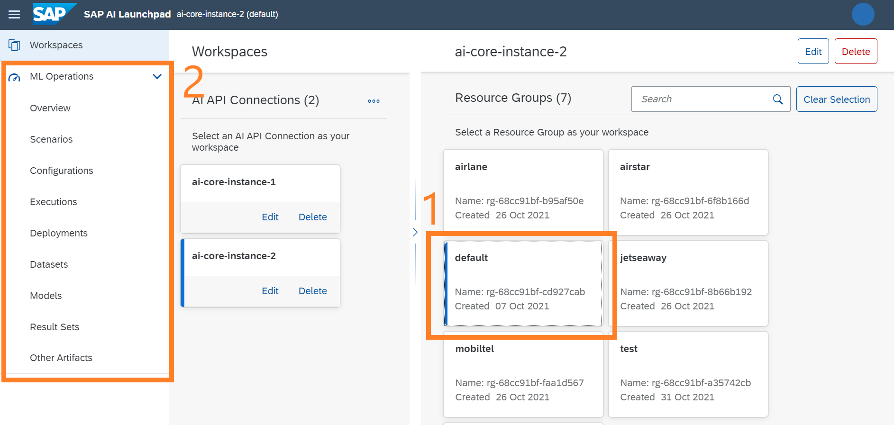

<!-- loiodf78271186f64e90ad9e34ce01b414b3 -->

# ML Operations

This section outlines the different components of the *ML Operations* app and how to use them for lifecycle management of a scenario.

The *ML Operations* app helps you manage the lifecycle tasks for an AI use case \(business project\), created for a resource group that exists on an AI runtime platform such as SAP AI Core.

A use case is a scoped project to realize business value through AI technology.

> ### Example:  
> In the [Example End-to-End Use Case](example-end-to-end-use-case-80e56fc.md), a hypothetical airline company has an AI use case relating to **feedback** classification \(complaints versus compliments\). The business use case involves classifying feedback \(texts\) as compliments or complaints.

A scenario is a technical realization of \(part of\) a use case benefitting from using AI technology.

> ### Example:  
> In the [Example End-to-End Use Case](example-end-to-end-use-case-80e56fc.md) to classify feedback, the ***text-clf-tutorial-scenario*** scenario is used.
> 
> 

The components within the *ML Operations* app are used to complete lifecycle tasks for AI scenarios.

Use the *ML Operations* app components to complete the following:

**Components Used in AI Lifecycle**

<table>
<tr>
<th valign="top">

Lifecycle Tasks for a Scenario \(AI use case\)

</th>
<th valign="top">

Component in *ML Operations* app

</th>
</tr>
<tr>
<td valign="top">

Set and track values \(dataset and parameters\) for training a model

</td>
<td valign="top">

Configurations

</td>
</tr>
<tr>
<td valign="top">

Train and generate an AI models using configuration settings

</td>
<td valign="top">

Executions

</td>
</tr>
<tr>
<td valign="top">

Select the most recently trained model for a deployment pipeline

</td>
<td valign="top">

Configurations

</td>
</tr>
<tr>
<td valign="top">

Deploy the AI model and generate endpoints for consumption using configuration

</td>
<td valign="top">

Deployments

</td>
</tr>
</table>

The *ML Operations* app is used to complete lifecycle tasks for the scenarios available in your selected AI API connection \(and the selected resource group\). Your actions do not change other resource groups \(present within same AI API connection\), even if the same scenario is shared by different resource groups. For more information, see [Set Resource Group](set-resource-group-0c07728.md#loio0c077289f29d4147921fb07ab0f68b7f).

<a name="loiodf78271186f64e90ad9e34ce01b414b3__section_jmx_vxk_wqb"/>

## Prerequisites

A valid AI API connection is required before you can access the *ML Operations* app. To create a connection to the underlying AI runtime, see [Add Connection to SAP AI Core](add-connection-to-sap-ai-core-71dfe2c.md).

> ### Note:  
> If you are unable to access the features, refer role requirements at the bottom of this page.

<a name="loiodf78271186f64e90ad9e34ce01b414b3__section_r1r_rxk_wqb"/>

## Accessing the App

You access the *ML Operations* app within SAP AI Launchpad via the side navigation panel.

To access the app:

1.  Select the connection to your runtime in the *Workspaces* app.

    The *ML Operations* app is now visible in your side navigation panel, and resource groups are listed.

    

2.  Select the resource group from the *Resource Group* pane in the *Workspaces* app. This enables access to the components within the *ML Operations*.

    

> ### Note:  
> When you select an AI API connection \(to your AI runtime\) as your workspace, you'll see that the *ML Operations* app becomes accessible and the components for *Configurations*, *Executions*, *Deployments*, *Datasets*, *Models*, *Result Sets* and *Other Artifacts* are disabled in the side navigation panel. This is because access to these components is tied to a resource group. You'll need to select a resource group within your workspace to access these components \(demonstrated in images above\). For more information, see [Set Resource Group](set-resource-group-0c07728.md#loio0c077289f29d4147921fb07ab0f68b7f).

> ### Note:  
> If some components are still inaccessible after selecting a resource group as your workspace, then you do not have the access rights required to view these components. Contact your administrator to grant you the required roles.

<a name="loiodf78271186f64e90ad9e34ce01b414b3__section_rjt_xxk_wqb"/>

## Role Requirements

 *ML Operations* app users should be assigned the following roles:

-   `operations_manager` to access the *ML Operations* app in the side navigation panel

-   `mloperations_viewer` to view app content, or

-   `mloperations_editor` to view and change app content

-   **[Overview](overview-cd1387d.md "The ML
                                    Operations app
		provides an overview of  statistics for your scenarios within your SAP AI Core (AI runtime),
		used by your selected connection.")**  
The *ML Operations* app provides an overview of statistics for your scenarios within your SAP AI Core \(AI runtime\), used by your selected connection.
-   **[Scenarios](scenarios-e60f102.md "A scenario in the ML
                                    Operations app is a
		collection of executables. ")**  
A scenario in the *ML Operations* app is a collection of executables.
-   **[Configurations](configurations-3c9d504.md "Configurations combine artifacts (such as datasets or models) with executables, so that training or deployment processes can be
		undertaken.")**  
Configurations combine artifacts \(such as datasets or models\) with executables, so that training or deployment processes can be undertaken.
-   **[Executions](executions-6a6afd5.md "An execution is a training process or batch inferencing process for an AI scenario. The
		behavior of an execution is determined by the code pieces in the workflow
		executable.")**  
An execution is a training process or batch inferencing process for an AI scenario. The behavior of an execution is determined by the code pieces in the workflow executable.
-   **[Deployments](deployments-0543c2c.md "A deployment runs a model for serving (inferencing) purposes. You use deployments to make online predictions.")**  
A deployment runs a model for serving \(inferencing\) purposes. You use deployments to make online predictions.
-   **[Schedules](schedules-06a6cde.md "Set up a periodic scheduling of workflow executions to automate execution creation, and define its parameters such as the recurrence
		period and recurrence duration. Users can update a schedule to change its recurrence period of operation and job.")**  
Set up a periodic scheduling of workflow executions to automate execution creation, and define its parameters such as the recurrence period and recurrence duration. Users can update a schedule to change its recurrence period of operation and job.
-   **[Datasets](datasets-e299ed5.md " A dataset is a type of artifact which is registered in your AI runtime. A registered dataset references files that are stored in your
		connected hyperscaler object store.")**  
 A dataset is a type of artifact which is registered in your AI runtime. A registered dataset references files that are stored in your connected hyperscaler object store.
-   **[Models](models-aba8797.md "A model is a type of artifact that results from a training process. ")**  
A model is a type of artifact that results from a training process.
-   **[Result Sets](result-sets-cc7bacc.md "A result set is a type of artifact that results from an execution used for batch inferencing. ")**  
A result set is a type of artifact that results from an execution used for batch inferencing.
-   **[Other Artifacts](other-artifacts-fae21be.md "Any artifact that cannot be categorized as a dataset, model, or result set is registered as an other artifact.")**  
Any artifact that cannot be categorized as a dataset, model, or result set is registered as an other artifact.

**Related Information**  

[Set Resource Group](set-resource-group-0c07728.md#loio0c077289f29d4147921fb07ab0f68b7f "You select a connection and resource group so that you can complete tasks within the ML Operations app.")

[Custom Access for Resource Groups](custom-access-for-resource-groups-19e3932.md "You can selectively control users' access to resource groups (within an AI runtime connection) in SAP AI Launchpad.")

