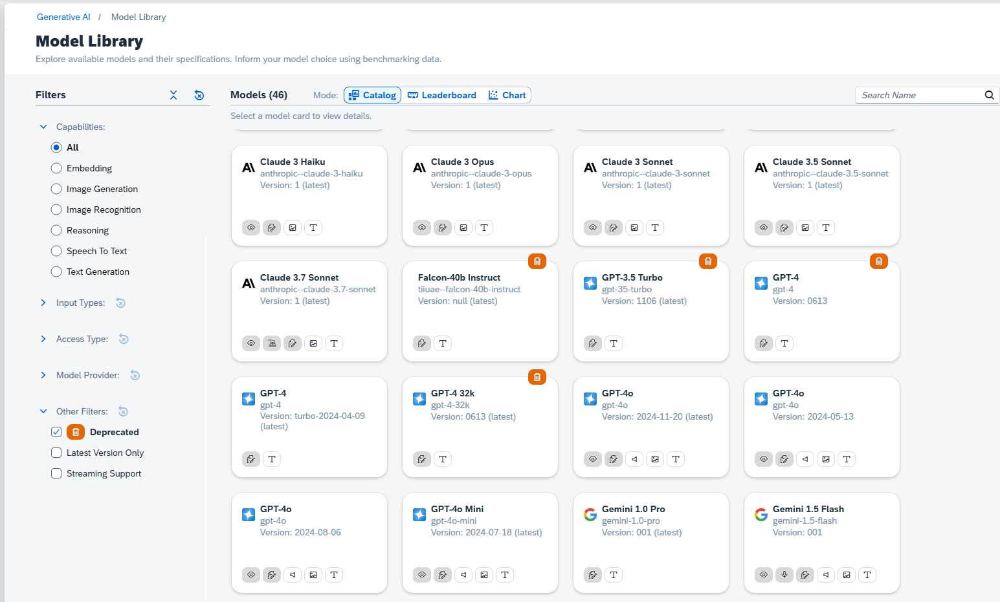

<!-- loiobe3cd61a58514a958de988f0dd8bea57 -->

<link rel="stylesheet" type="text/css" href="css/sap-icons.css"/>

# Model Configuration

In this section, you select the model that you want to use in your workflow. If you don't select a model, the default model will be used. You can also include further parameters in JSON format. For information about the supported parameters, see the documentation of the model provider.

You can see which models are available within an orchestration deployment by selecting the deployment ID.

You can adjust the parameters by using the sliders

You can add custom parameters by choosing the  \(code\) icon and entering additional parameters in JSON format. Custom parametersand their values must be supported by the model selected. For information about supported parameters, check the documentation from the model provider.

When you run the workflow, you will receive one response from the model. If you want to receive multiple responses, you can set a value for the `n` parameter in the model configuration.

> ### Example:  
> If you enter `"n":3` in the model configuration, the model will generate three different responses based on your prompt template.
> 
> 

> ### Note:  
> For models from Anthropic, the `max_tokens` parameter is mandatory and is added to *additional parameters* automatically. Users can update the parameter value, but the parameter should not be removed.

