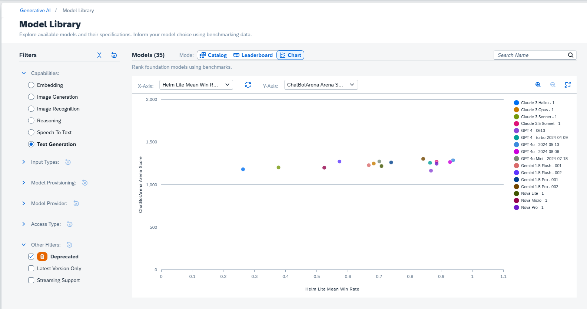

<!-- loiofce6fea2f901406cae47013bd7b62474 -->

<link rel="stylesheet" type="text/css" href="css/sap-icons.css"/>

# Model Library

Explore available models and their specifications. Inform your model choice using benchmarking data.

<a name="loiofce6fea2f901406cae47013bd7b62474__section_y5p_prr_pdc"/>

## Prerequisites

You have the `genai_experimenter`, `genai_manager`, `genai_administrator` or `orchestration_executor` role, or a role collection that contains one. For more information, see [Roles and Authorizations](security-e4cf710.md#loio4ef8499d7a4945ec854e3b4590830bcc).

<a name="loiofce6fea2f901406cae47013bd7b62474__section_qzj_trr_pdc"/>

## Context

Model library contains information on models available in the generative AI hub to aid decision making.

To explore models available in generative AI hub and their metadata, use the catalog mode.

To inform your decision making using benchmarking data, use the leaderboard mode.

To view detailed information for a single model such as data input types, cost information and metrics where available, view its model card.

<a name="loiofce6fea2f901406cae47013bd7b62474__section_o4k_vrr_pdc"/>

## Procedure

1.  Select the connection to your SAP AI Core runtime in the *Workspaces* app.

2.  You can use model library without selecting a resource group. However, if you select a resource group you will be able to use models directly through the model library later.

    **Optional:**Choose the resource group that was used for your generative AI hub deployment.

3.  In the side navigation, expand the *Generative AI Hub* and choose *Model Library*.

You can view model specifications and benchmarking data through the following modes:

<a name="loiofce6fea2f901406cae47013bd7b62474__section_o53_r4c_pdc"/>

## Catalog

The catalog mode shows all available models.

To refine the model selection, apply the filters.

To search for a model by name, use the search bar.

Choose a model to see it's model card. The model card provides detailed information on the model, such as data input types, cost information and metrics where available.

To view a deprecation notice, hover over the deprecation icon.

<a name="loiofce6fea2f901406cae47013bd7b62474__section_a5v_c4c_pdc"/>

## Leaderboard

The leaderboard mode shows model scores across a range of benchmarks.

To refine the model selection, apply the filters.

To search for a model by name, use the search bar.

To reorder the model list based on a benchmark, choose the corresponding header and make your selection.

To view a deprecation notice, hover over the deprecation icon.

Choose a model from the list to see it's model card. The model card provides detailed information on the model, such as data input types, cost information and metrics where available.

For models with tiered pricing, select the pricing entry to view pricing details.

<a name="loiofce6fea2f901406cae47013bd7b62474__section_ilx_cd2_d2c"/>

## Chart

The chart mode shows model scores across a range of benchmarks in chart format.

To refine the model selection, apply the filters.

To search for a model by name, use the search bar.

To zoom, use the *Zoom in* and *Zoom Out* icons.

To specify which variable is on which axis, use the respective drop down menus.

To switch the axes, use the :arrows_clockwise: icon.

To view the chart in a separate window, use the *Full Screen* icon.

Choose a data point to see a small summary. Choose *View Details* to view the model card. The model card provides detailed information on the model, such as data input types, cost information and metrics where available.

<a name="loiofce6fea2f901406cae47013bd7b62474__section_pwg_t4c_pdc"/>

## Model Cards

To see more information, navigate through the tabs.

To see the status of deployments containing the model, refresh and choose  \(Cloud\).

To deploy the model, choose *Deploy*.

> ### Restriction:  
> Only for users with `mloperations_editor` or `scenario_deployment_editor` roles, and who have selected a resource group.

To use the model, select *Use in *<App\>** where available. For example, *Use in Chat* may be available where applicable.

> ### Restriction:  
> Only users with `genai_experimenter` or `genai_manager` roles, and who have selected a resource group, and who have a running deployment for the model can select *Use in Prompt*.
> 
> Only users with `genai_experimenter` or `genai_manager` roles, and who have selected a resource group, and who have a running orchestration deployment can select *Use in Chat*.

