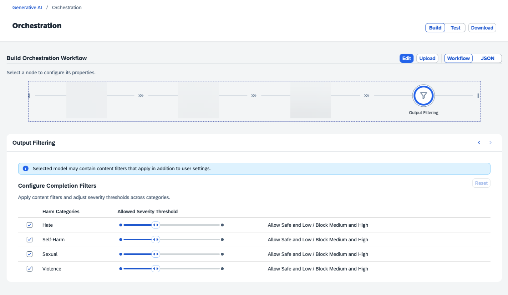

<!-- loio32a0e42682c84ad9a6681572db5f8364 -->

# Output Filtering

Output filtering lets you decide the type of content that is received from the generative AI model.

The module supports the Azure Content Safety classification service. This service recognizes four distinct content categories: `Hate`, `Violence`, `Sexual`, and `SelfHarm`. For more information, see [Harm categories in Azure AI Content Safety](https://learn.microsoft.com/en-us/azure/ai-services/content-safety/concepts/harm-categories?tabs=warning). Text can have more than one label \(for example, a text sample can be classified as both `Hate` and `Violence`\). The returned content categories include a severity level rating of 0, 2, 4, or 6. The value increases with the severity of the content.

> ### Note:  
> Some generative AI models have content filters incorporated into their standard offering. This means that content may be filtered irrespective of the settings that you configure here.

If you edit the workflow, you can hide the filter section.

