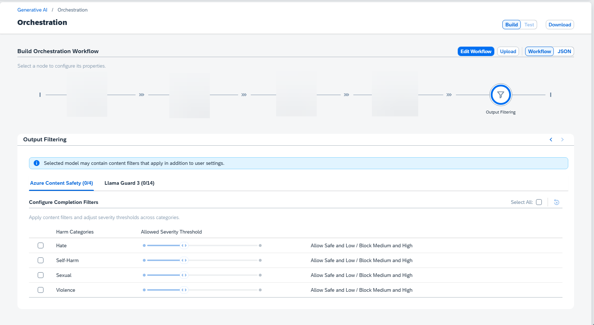

<!-- loio32a0e42682c84ad9a6681572db5f8364 -->

# Output Filtering

Output filtering lets you decide the type of content that is received from the generative AI model.

The module supports the following filters:

-   **Azure Content Safety:** This service recognizes four distinct content categories: `Hate`, `Violence`, `Sexual`, and `SelfHarm`. For more information, see [Harm categories in Azure AI Content Safety](https://learn.microsoft.com/en-us/azure/ai-services/content-safety/concepts/harm-categories?tabs=warning). Text can have more than one label \(for example, a text sample can be classified as both `Hate` and `Violence`\). The returned content categories include a severity level rating of 0, 2, 4, or 6. The value increases with the severity of the content.
-   **Llama Guard 3:** This service reognizes a range of categories inclduing `Hate`, `Specialized Advice`, `Defamation` and `Sexual Content`. For more information, see [Llama Guard 3](https://www.llama.com/docs/model-cards-and-prompt-formats/llama-guard-3/). Harm categories are Boolean values.

> ### Restriction:  
> For DeepSeek and Aleph Alpha Pharia models, output filtering is mandatory and cannot be disabled. All available content categories are selected by default, and content categories cannot be deselected individually. If all content categories for all content filters are manually deselected, all content categories for at least one filter will be selected automatically.

> ### Note:  
> Some generative AI models have content filters incorporated into their standard offering. This means that content may be filtered irrespective of the settings that you configure here.

If you edit the workflow, you can hide the filter section.

