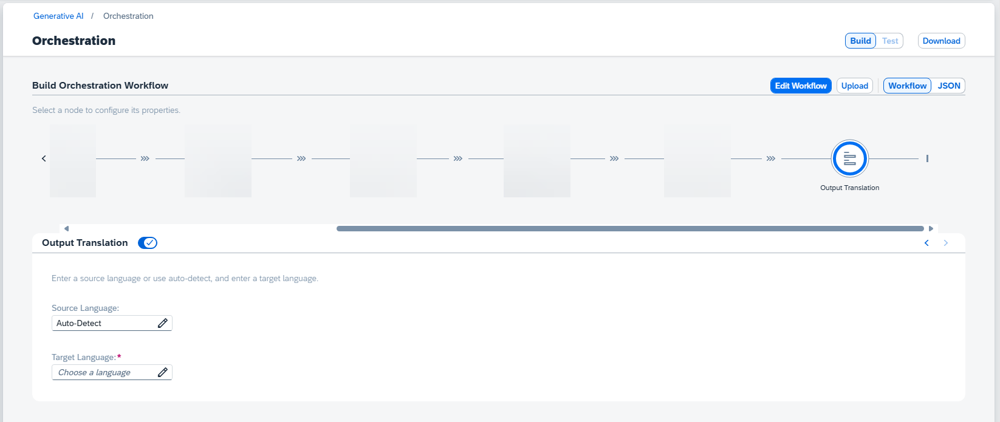

<!-- loioe350c561a1c3475087a4bf9ddadc5715 -->

# Output Translation

The output translation module is optional. It allows you to translate LLM output into a chosen target language.

To use output translation, configure it as part of your orchestration workflow.

The module supports SAP's Document Translation service \(part of the SAP Translation Hub\).

> ### Caution:  
> Output translation is performed **after** any configured output unmasking. Unmasked output is sent to the translation service.

For source language, you can choose one of the available languages, or no language is chosen, *Auto-Detect* will be used.

The target language is mandatory, choose from the available languages. The available languages may change based on your source language selection. For more information about compatible language pairs, see [SAP Translation Hub Supported Languages](https://help.sap.com/docs/SAP_TRANSLATION_HUB/ed6ce7a29bdd42169f5f0d7868bce6eb/6854bbb1bd824ffebc3a097a7c0fd45d.html).

> ### Caution:  
> Using unsupported pairs through auto-detect or source language input errors may result in error or poor quality results.

